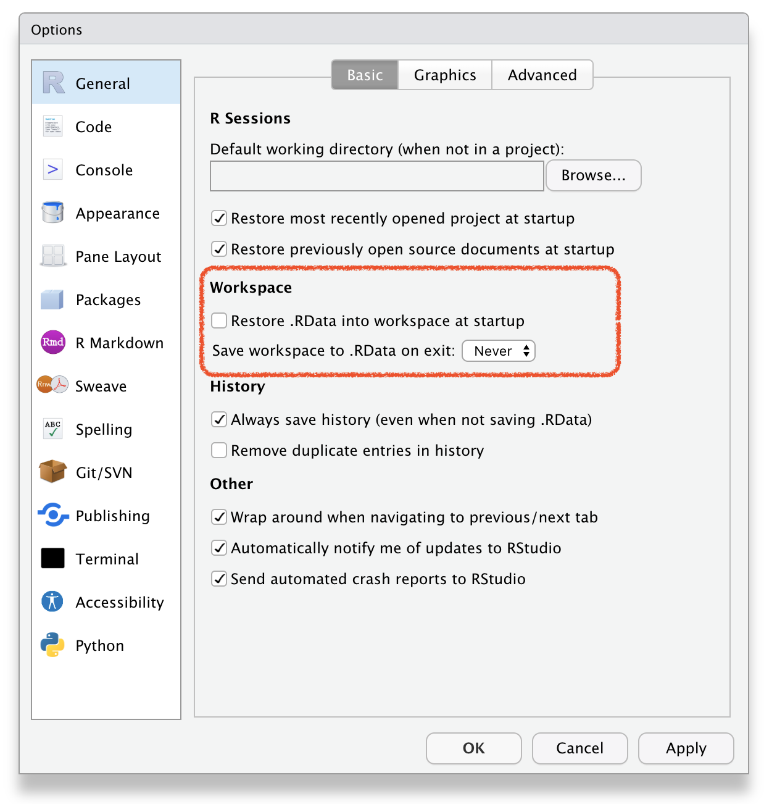
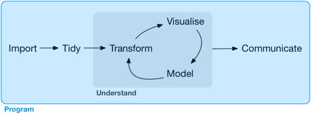
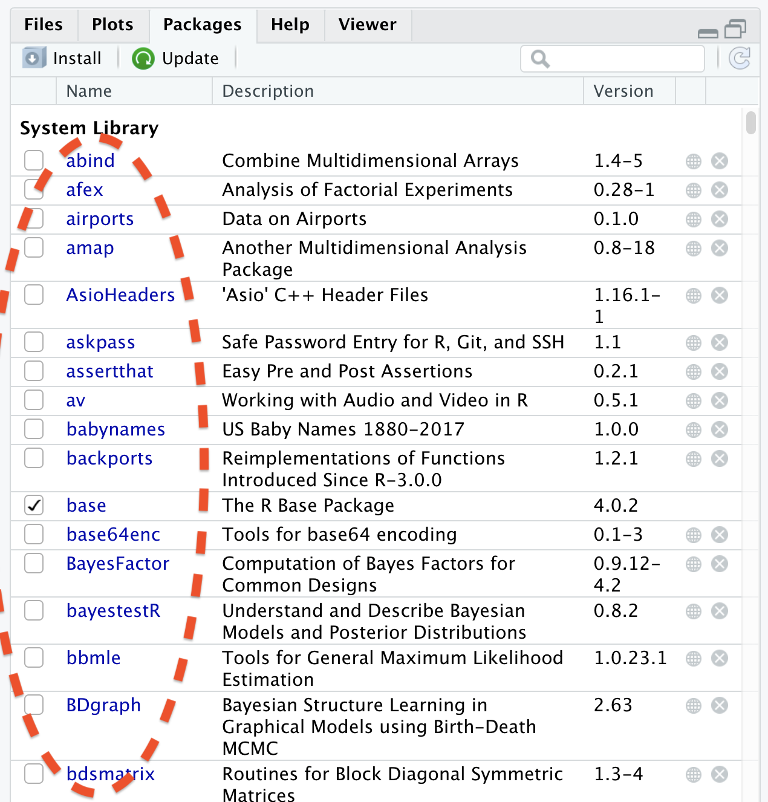

```{r setup, include=FALSE}
options(htmltools.dir.version = FALSE)
knitr::opts_chunk$set(collapse = TRUE,
                      fig.retina = 3,
                      echo = FALSE,
                      fig.align='center')
library(countdown)
library(ymlthis)
library(tidyverse)
library(ggthemes)
library(icons)
library(icon)
library(xaringanExtra)
library(emoji)
library(palmerpenguins)
xaringanExtra::use_tachyons()
xaringanExtra::use_tile_view()
xaringanExtra::use_webcam()
xaringanExtra::use_fit_screen()
xaringanExtra::use_extra_styles(hover_code_line = TRUE, mute_unhighlighted_code = TRUE)
xaringanExtra::use_share_again()
xaringanExtra::use_panelset()
```

```{r meta, echo=FALSE}
library(metathis)
meta() %>%
  meta_general(
    description = "Ajay Koli - Vishwakarma University",
    generator = "xaringan and remark.js"
  ) %>% 
  meta_name("github-repo" = "koliajaykr/plagiarism-zotero") %>% 
  meta_social(
    title = "Research Methodlogy",
    url = "https://starm.netlify.app/",
    image = "https://starm.netlify.app/images/social-card.png",
    og_type = "talk",
    og_author = "Ajay Koli",
    twitter_card_type = "summary_large_image",
    twitter_creator = "@ajay_kolii"
  ) %>%
  include_meta()
```

class: hide-logo, hide-count, inverse

background-image: url("images/flyer.png")
background-size: contain

---

class: title-slide, center, middle, hide-count, hide-logo

background-image: url("https://images.unsplash.com/photo-1513890333407-6f85205e8ef2?ixlib=rb-1.2.1&ixid=MnwxMjA3fDB8MHxwaG90by1wYWdlfHx8fGVufDB8fHx8&auto=format&fit=crop&w=1770&q=80")
background-size: cover

# .big-text.black[ `r rmarkdown::metadata$title`]

<br>
<br>
<br>
<br>
<br>

---
class: middle, hide-logo

.pull-left[
```{r , echo=FALSE, out.width="70%", fig.align='left'}

knitr::include_graphics("images/ajaykoli.png") 
# `r format(Sys.Date(), "%d %B %Y") 
# <i class="fab fa-r-project"></i>
```

Dr Ajay Kumar Koli<br>Assistant Professor<br>Department of Travel & Tourism<br>Vishwakarma University - Pune<br>`r icon::fa("twitter")` [@ajay_kolii](https://twitter.com/ajay_kolii)<br>`r icon::fa("envelope")` [koliajaykumar@gmail.com](koliajaykumar@gmail.com)

]

.pull-right[
<br>
<br>
<br>
<br>
# .big-text[Hello! `r emo::ji("blush")`]

]

---

# Schedule:
  
`r emo::ji("man_teacher")` Total five live sessions

`r emo::ji("date")` 24, 25, 27, 28 & 29 Jan 2022

`r emo::ji("alarm_clock")` from 04:00 to 06:00 PM IST.

--

`r emo::ji("high_voltage")` Google Meet

--

`r emo::ji("brain")` YOUR TURN

--

`r emo::ji("exploding_head")` Assessments:
  - First on 25th Jan 2022 | Deadline of submission: 26 Jan 2022 at 21:30 PM) 
  - Second on 29th Jan 2022 | Deadline of submission: 30 Jan 2022 at 21:30 PM)

--

`r emo::ji("award")` E-Certificates (Attendance + Assessments)

---

# Modules:

1. .b.green[Basics of R & RStudio]

1. Dynamic Documents using R Markdown

1. Data Visualisation using ggplot2

1. Data Wrangling using dplyr

1. Slidecrafting using xaringan

---

class: title-slide, right, middle, hide-count, hide-logo

background-image: url("https://images.unsplash.com/photo-1513949474464-08a0bdb4fa54?ixlib=rb-1.2.1&ixid=MnwxMjA3fDB8MHxwaG90by1wYWdlfHx8fGVufDB8fHx8&auto=format&fit=crop&w=1770&q=80")
background-size: cover

# .white.big-text[R  and<br>RStudio:<br>Basics] 
## .white.black[Session - 1]

---

class: hide-logo

background-image: url("https://github.com/allisonhorst/stats-illustrations/raw/master/rstats-artwork/r_first_then.png")
background-size: contain

.footnote[
[Source](https://github.com/allisonhorst/stats-illustrations)
]

---

# `r emo::ji("heart_eyes")` R is FREE 

- R is a language and environment for statistical computing and graphics. (R project)

--

- In August 1993, designed by

.pull-left[
```{r founders-r1, out.width="80%", fig.align='center', fig.cap="Ross Ihaka <br>(New Zealand Statistician)"  }
knitr::include_graphics("https://upload.wikimedia.org/wikipedia/commons/f/f0/Ross_Ihaka_%285189180796%29.jpg")
```

]

.pull-right[
```{r founders-r2, out.width="50%",  fig.align='center', fig.cap="Robert Gentleman<br>(Canadian Statistician)"}
knitr::include_graphics("https://www.computerhope.com/people/pictures/robert_gentleman.jpg")
```

]

---

class: center

# Download R from [CRAN](https://cran.r-project.org/mirrors.html)

```{r cran, fig.align='center', out.width="80%"}
knitr::include_graphics("images/cran.png")
```

---

class: right

.pull-left[
# R Console

##- R version

##- R name

##- R licence

##- prompt `>`
]

.pull-right[

```{r console-img, out.width="100%", fig.align='left'}
knitr::include_graphics("images/console.png")
```
]

---

# .red[Never Save R "Workspace Image":]

.pull-left[
- It helps in "freshly minted R sessions".

- "put more trust in your script than in your memory"

.footnote[
[Source](https://www.r-bloggers.com/2017/04/using-r-dont-save-your-workspace/)
]

]

.pull-right[

```{r quit, out.width="75%", fig.align='center'}
knitr::include_graphics("images/quit.png")
```
]

---

# .center[R as a BIG calc]

.pull-left[

### .center[What you code]

```{r calci1, eval=FALSE, echo=TRUE}
1 #<<
```

]

.pull-right[

### .center[What you see]

```{r ref.label="calci1", echo=FALSE}
```

]

---

# .center[R as a BIG calc]

.pull-left[

### .center[What you code]

```{r calci2, eval=FALSE, echo=TRUE}
1
1 + 1 #<<
```

]

.pull-right[

### .center[What you see]

```{r ref.label="calci2", echo=FALSE}
```

]


---

# .center[R as a BIG calc]

.pull-left[

### .center[What you code]

```{r calci3, eval=FALSE, echo=TRUE}
1
1 + 1
34 / 40 #<<
```

]

.pull-right[

### .center[What you see]

```{r ref.label="calci3", echo=FALSE}
```

]

---

# .center[R as a BIG calc]

.pull-left[

### .center[What you code]

```{r calci4, eval=FALSE, echo=TRUE}
1
1 + 1
34 / 40
5 < 4 #<<
```

]

.pull-right[

### .center[What you see]

```{r ref.label="calci4", echo=FALSE}
```

]

---

# .center[R as a BIG calc]

.pull-left[

### .center[What you code]

```{r calci5, eval=FALSE, echo=TRUE}
1
1 + 1
34 / 40
5 < 4
16 == 16 #<<
```

]

.pull-right[

### .center[What you see]

```{r ref.label="calci5", echo=FALSE}
```

]

---

# .center[Plot using R]

.panelset[
  
  .panel[.panel-name[Code]

```{r plot1, eval=FALSE, echo=TRUE}
plot(1:100) #<<
```

]
  .panel[.panel-name[Output]

```{r ref.label="plot1", echo=FALSE, out.width="40%"}
```

]
]

---

class: inverse, hide-count, center, bottom, hide-logo
background-image: url("images/rainbowr.gif")
background-size: 50%
background-position: 50% 5%

# .bottom.big-text[Functions]

---

# R Function

- "A function, in a programming environment, is **a set of instructions**. A programmer builds a function to .b[avoid repeating the same task], or reduce complexity."

<br>

--

.panelset[
  
  .panel[.panel-name[Code]
  
```{r func1, eval=FALSE, echo=TRUE}
round(9.1565, 2) #<<
```

]
  .panel[.panel-name[Output]
  
```{r ref.label="func1", echo=FALSE}
```

]
]

---

class: center
background-image: url("images/function-args.png")
background-size: 90%
background-position: 60% 70%

# Structure of R function

---

# .center[Round Function]

.panelset[
  
  .panel[.panel-name[Code]

```{r func2, eval=FALSE, echo=TRUE}
round(x = 564.56743, digits = 2)
```

]
  .panel[.panel-name[Output]

```{r ref.label="func2", echo=FALSE}
```

]
]

---

# .center[Round Function]

.panelset[
  
  .panel[.panel-name[Code]
  
```{r func3, eval=FALSE, echo=TRUE}
round(x = 564.56743, digits = 1)
```

]

  .panel[.panel-name[Output]

```{r ref.label="func3", echo=FALSE}
```

]
]

---

# .center[Square Root Function]

.panelset[
  
  .panel[.panel-name[Code]

```{r sqrt, eval=FALSE, echo=TRUE}
sqrt(x = 9) #<<
```

]

  .panel[.panel-name[Output]
  
```{r ref.label="sqrt", echo=FALSE}
```

]
]

---

# .center[Sequence Function]

.panelset[
  
  .panel[.panel-name[Code]

```{r seq, eval=FALSE, echo=TRUE}
seq.int(from = 10, to = 30, by = 5) #<<
```

]

  .panel[.panel-name[Output]

```{r ref.label="seq", echo=FALSE}
```

]
]

---

class: inverse, hide-count, center, bottom, hide-logo

background-image: url("images/stormyr.gif")
background-size: 42%
background-position: 50% 5%

# .bottom.big-text[Comments]

---

# R Comment:

- "Humans will be able to read the comments, but your computer will pass over them."<sup>1</sup>

--

- in R `#` is used as a commenting symbol

.footnote[
[Source](https://en.wikipedia.org/wiki/Comment_(computer_programming)
]

---

# .center[How to add comment?]

.panelset[
  
  .panel[.panel-name[Code]
  
```{r comment, eval=FALSE, echo=TRUE}
# secret code of happiness

(1 + 4) - (3 * 5) / 10

## r does not evaluate this
# all these are comments
# comments are very important
```

]         

  .panel[.panel-name[Output]
  
```{r ref.label="comment", echo=FALSE}
```         
         
  ]
  
]


---

# `r emo::ji("smirk_cat")` *That's okay but you promise to...*

--

- combine plot, text, tables and images in a single file.

--

- publish my work online or convert into a word, pdf or html file.

--

- work efficiently with my different projects and save, share and track them.

--

## .orange[WE NEED A SUPERHERO ... ]

---
class: center, middle, hide-count, hide-logo

background-image: url("https://www.rstudio.com/wp-content/uploads/2018/10/RStudio-Logo-Flat.png")
background-size: contain

---

class: hide-logo

background-image: url("https://res-5.cloudinary.com/crunchbase-production/image/upload/c_thumb,h_256,w_256,f_auto,g_faces,z_0.7,q_auto:eco/v1398402407/chvmdsmomg96uoz8g3ad.jpg")
background-size: 20%
background-position: 99% 1%

# `r emo::ji("heart_eyes_cat")` About RStudio:

- 2009, Joseph J. Allaire founded RStudio.

--

- 2011, RStudio IDE for R was launched.

--

- "RStudio is dedicated to sustainable investment in free and open-source software for data science." (16 Jan 2022)

.footnote[
[Source](https://www.rstudio.com/about/)
]

---
class: center

# R $\rightleftharpoons$ RStudio

--

.pull-left[
## Imagine RStudio as a stylish car ...

# .big-text[`r emo::ji("car")`]
]

--

.pull-right[
## and R as its powerful engine.

# .big-text[`r emo::ji("gear")`]
]

---

class: center

# RStudio IDE

```{r ide, out.width="80%"}
knitr::include_graphics("images/rstd-ide.png")
```


---

class: center

### RStudio $\rightarrow$ Tools $\rightarrow$ Global Options

```{r settings, out.width="50%"}

```

---

class: center

### RStudio $\rightarrow$ Tools $\rightarrow$ Global Options

```{r settings2, out.width="50%"}
knitr::include_graphics("images/rstd-options2.png")
```

---

class: center, hide-logo

background-image: url("images/learn.png")
background-size: 125%

background-color: #F5F4F2

.footnote[
[Source](https://education.rstudio.com)
]

---
class: center middle

# R Program

```{r ds1, out.width="100%"}
knitr::include_graphics("images/data-science.png")
```


.footnote[
[Source](https://r4ds.had.co.nz/introduction.html)
]

---
class: center middle

# Data Wrangling

```{r ds-wrang, out.width="100%"}
knitr::include_graphics("images/data-science-wrangle.png")
```

.footnote[
[Source](https://r4ds.had.co.nz/introduction.html)
]

---
class: center middle

# Exploratory Data Analysis

```{r ds-expl, out.width="100%"}
knitr::include_graphics("images/data-science-explore.png")
```

.footnote[
[Source](https://r4ds.had.co.nz/introduction.html)
]

---
class: center middle

# Modeling

```{r ds-mdl, out.width="100%"}
knitr::include_graphics("images/data-science-model.png")
```

.footnote[
[Source](https://r4ds.had.co.nz/introduction.html)
]

---
class: center middle

# Data Visualisation

```{r ds-comm, out.width="100%"}
knitr::include_graphics("images/data-science-communicate.png")
```

.footnote[
[Source](https://r4ds.had.co.nz/introduction.html)
]

---
class: center middle

# R Program

```{r ds-prog, out.width="100%"}

```

.footnote[
[Source](https://r4ds.had.co.nz/introduction.html)
]

---

class: hide-count, hide-logo

background-image: url("https://pbs.twimg.com/media/FJJ3qyAXwAQSI8s?format=jpg&name=medium")
background-size: 70%
background-position: 70%  

.footnote[
[Source](https://twitter.com/mdancho84/status/1482378806929276937/photo/1)
]


---

class: center, middle, hide-count, hide-logo

background-image: url("images/space-pkgs.png")
background-position: 110%
background-size: contain

.pull-left[
# .big-text[R<br>Packages]
]

---

# R Packages:

- On 12 Jan 2022, 18698 R packages were available at [CRAN](https://cran.r-project.org/web/packages/)

--

- "An R package is a collection of functions, data, and documentation that extends the capabilities of base R. Using packages is key to the successful use of R."

--

- Top downloaded packages [source](https://www.r-pkg.org/downloaded)

.footnote[
[Source](https://r4ds.had.co.nz/introduction.html)
]

---
class: center

# To Download pkgs

```{r echo=FALSE, out.width="65%"}
knitr::include_graphics("images/pkg-download1.png")
```

---
class: center

# Name of the R package(s)

```{r echo=FALSE, out.width="65%"}
knitr::include_graphics("images/pkg-download2.png")
```

---
class: center

# Installed R package(s)

```{r echo=FALSE, out.width="50%"}
 
```

---

# Download R pkg using console

```{r pkg-install, echo=T, eval=FALSE}
install.packages("tidyverse") #<<
```

--

# How to use R package?

```{r pkg-use, echo=T, eval=FALSE}
library(tidyverse) #<<
```

---

# `r emo::ji("rotating_light")` About R Packages:

- You need to install package only once like

  - `r emo::ji("books")` We buy books once and use them again and again

--

  - `r emo::ji("bulb")` Fix the bulb once and use it again and again 

--

- In every R document you need to `call once` the package using function `library()`, for example library(ggplot2).

--

- Once in a while, you need to update the installed packages as well.


--

- If you un-install R or RStudio, you will lose all installed packages.

---

class: center

# Tools $\rightarrow$ Check Package Updates

```{r echo=FALSE, out.width="45%"}
knitr::include_graphics("images/update-pkg1.png")
```

---
class: center

# Select Package(s) to Update

```{r echo=FALSE, out.width="60%"}
knitr::include_graphics("images/update-pkg2.png")
```

---
class: center

# Click Install Updates

```{r echo=FALSE, out.width="60%"}
knitr::include_graphics("images/update-pkg3.png")
```

---
class: center

# To Remove Package(s)

```{r echo=FALSE, out.width="60%"}
knitr::include_graphics("images/remove-pkg.png")
```

---

class: inverse, your-turn, hide-logo

# `r emo::ji("brain")` YOUR TURN

- Install R packages `xaringan` & `palmerpenguins`.

- Check whether they are installed.

```{r echo=FALSE}
countdown(minutes = 5, top = 0, font_size = "3em")
```

---

class: hide-count, center, middle, hide-logo
background-image: url("images/heartyr.gif")
background-size: contain
background-position: 5%

# .right.big-text[Objects]

---

# R Object

##- "Just a name that you can use to call up stored data"

.footnote[
Source: [RStudio](https://rstudio-education.github.io/hopr/basics.html) 
]

---

# Guidelines to name `objects` in R:

  - a name cannot start with a number  
  
--

  - a name cannot use some special symbols, like ^, !, $, @, +, -, /, or *:  
  
--

  - avoid caps  
  
--

  - avoid space  
--

  - use dash (like na-me) or underscore (like na_me)  
  
--

  - if chronology matters then add date (2020-09-05-file-name)

---

# .center[Create Object]

.panelset[

.panel[.panel-name[Code]
```{r obj1, eval=FALSE, echo=TRUE}
salary <- c(20, 30, 40, 50, -10) #<<
salary #<<
```

]

.panel[.panel-name[Output]

```{r ref.label="obj1", echo=FALSE}
```
]

]

---

# .center[Create Object]

.panelset[
  
.panel[.panel-name[Code]
         
```{r obj2, eval=FALSE, echo=TRUE}
name <- c("Ram", "Rani", "Ali", "Preeti", "John")
name
```
         
]
  
.panel[.panel-name[Output]
         
```{r ref.label="obj2", echo=FALSE}
```         
]
  
]

---

# .center[Create Object]

.panelset[
  
  .panel[.panel-name[Code]
  
```{r obj4, eval=FALSE, echo=TRUE}
age <- c(34, 54, 23, 65, 2 )
age
```
      
  ]
  
  .panel[.panel-name[Output]
  
```{r ref.label="obj4", echo=FALSE}
```         
         
  ]
  
]

---

# .center[Create Object]

.panelset[
  
  .panel[.panel-name[Code]
         
```{r obj5, eval=FALSE, echo=TRUE}
place <- c("ny", "ber", "dhl", "tko", "lon")
place
```         
  ]
  
  .panel[.panel-name[Output]
```{r ref.label="obj5", echo=FALSE}
```         
         
  ]
  
]

---

# .center[Create Object]

.panelset[
  
  .panel[.panel-name[Code]
```{r obj6, eval=FALSE, echo=TRUE}
books <- c(4, 0, 3, 24, 5)
books
```
         
         
  ]
  
  .panel[.panel-name[Output]
```{r ref.label="obj6", echo=FALSE}
```         
         
  ]
  
]


---

class: center

# RStudio Environment Window

```{r echo=FALSE, out.width="70%"}
knitr::include_graphics("images/env-rstd.png")
```

--

## `r emo::ji("thinking")`.i.green[how to combine these<br> objects/variables into a data or say tidy data]

---
exclude: true

class: hide-count, hide-logo

background-image: url("images/tidydata_7.jpg")
background-size: cover

---
exclude: true

class: hide-count, hide-logo

background-image: url("images/tidydata_1_1.jpg")
background-size: contain

---
exclude: true

class: hide-count
background-image: url("images/tidydata_1_2.jpg")
background-size: contain

---
exclude: true

class: hide-count
background-image: url("images/tidydata_2_1.jpg")
background-size: contain

---
exclude: true

class: hide-count
background-image: url("images/tidydata_2_2.jpg")
background-size: contain

---

class: center

# Tidy data 👇 😻😻😻

```{r, echo=FALSE}
soc <- data.frame(
  age,
  books,
  name,
  place,
  salary
)
soc
```

--

```{r echo=FALSE, out.width="70%"}
knitr::include_graphics("images/tidy-1.png")
```

.footnote[
[Source](https://r4ds.had.co.nz/index.html)
]

---

# .center[How to create a data object?]

.panelset[
  
  .panel[.panel-name[Code]
```{r df1, eval=FALSE, echo=TRUE}
soc <- data.frame(age, books, name, place, salary) #<<

soc

# to save this data set as a csv file
write.csv(soc, "data/soc.csv")
```
         
    ]
  
  .panel[.panel-name[Output]
```{r ref.label="df1", echo=FALSE}
```         
         
  ]
  
]

---

# .center[How to export data as a csv file?]

.panelset[
  
  .panel[.panel-name[Code]
```{r exp, eval=FALSE, echo=TRUE}
# to save this data set as a csv file
write.csv(soc, "data/soc.csv") #<<
```
         
    ]
  
  .panel[.panel-name[Output]
```{r ref.label="exp", echo=FALSE}
```         
         
  ]
  
]

---

class: your-turn, hide-count, hide-logo

# `r emo::ji("brain")` YOUR TURN

```{r echo=FALSE}
countdown(minutes = 10, top = 0, font_size = "3em")
```

## .yellow[Write codes for below dataframe]

```{r echo=FALSE}
state <- c("Germany", "France", "India", "Russia", "USA", "New Zealand")
pop <- c(20, 19, 50, 25, 30, 5)
capital <- c("Berlin", "Paris", "Delhi", "Moscow", "Washington", "Wellington")
foundation <- c("1870-12-10", "1789-07-14", "1947-08-15", "1990-06-12", "1776-07-04", "1840-02-06")
world <- data.frame(state, pop, capital, foundation)
world
```

---

# .center[Get a List of all Objects]

.panelset[
  
  .panel[.panel-name[Code]
```{r obj3, eval=FALSE, echo=TRUE}
# names of created objects
objects() #<<
```
         
         
  ]
  
  .panel[.panel-name[Output]
```{r ref.label="obj3", echo=FALSE}
```         
         
  ]
  
]


---

class: center, middle, hide-count, hide-logo

background-image: url("images/breakr.gif")
background-size: 50%
background-position: 90%

.pull-left[
# .big-text[Need Help!]
]

---
class: center

# Using Console  `>`

## in console type `?your query`
--
<br><br>.green[for example] `?ggplot`

---

class: center

# RStudio: pkg Help Docs
  
```{r echo=FALSE, out.width="70%"}
knitr::include_graphics("images/help-cran.png") 
```

---
class: center

# [RStudio Community](https://community.rstudio.com/)
<br>
```{r echo=FALSE, out.width="90%"}
knitr::include_graphics("images/help-rstd.png") 
```

---
class: center

# [stackoverflow](https://stackoverflow.com/)
<br>
```{r echo=FALSE, out.width="90%"}
knitr::include_graphics("images/help-stack.png")
```

---
class: center

# [GitHub Issues](https://github.com/)

```{r echo=FALSE, out.width="100%"}
knitr::include_graphics("images/help-git.png")
```

---
class: center

# [Twitter](https://twitter.com/home) #rstats

```{r echo=FALSE, out.width="60%"}
knitr::include_graphics("images/help-tweet.png")
```

---

class: center middle hide-count

# `r emo::ji("man_raising_hand")` `r emo::ji("woman_raising_hand")`<br>.big-text[Q&A]

---

class: center, middle, inverse

# Dynamic Documents<br>Using R Markdown
### .orange[Next Session - 2]