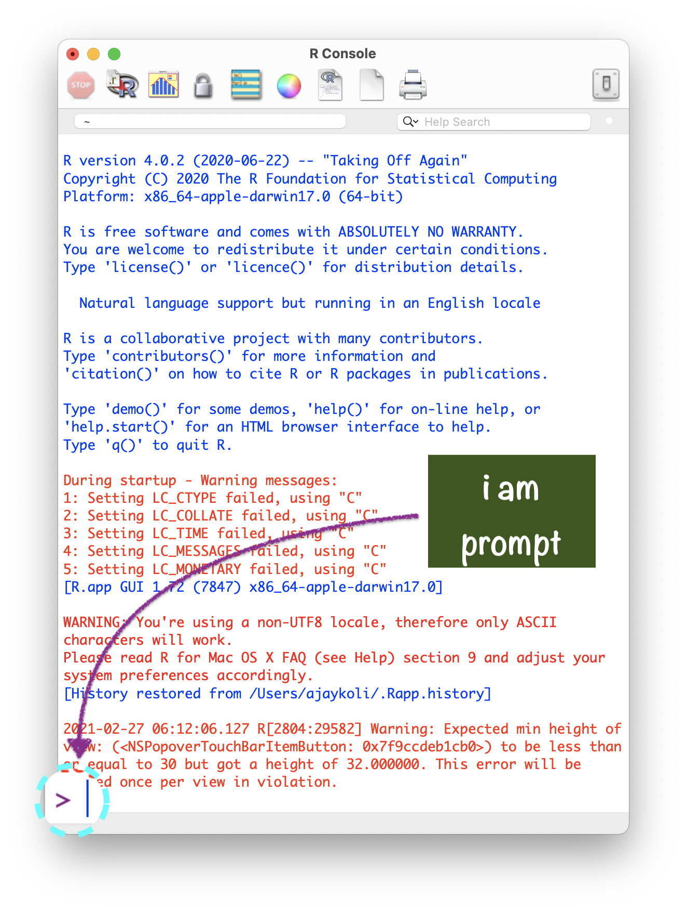

```{r setup, include=FALSE}
options(htmltools.dir.version = FALSE)
knitr::opts_chunk$set(collapse = TRUE,
                      fig.retina = 3,
                      echo = FALSE,
                      fig.align='center')
library(countdown)
library(ymlthis)
library(tidyverse)
library(ggthemes)
library(icons)
#library(icon)
library(xaringanExtra)
library(emoji)
library(palmerpenguins)
xaringanExtra::use_tachyons()
xaringanExtra::use_tile_view()
xaringanExtra::use_webcam()
xaringanExtra::use_fit_screen()
xaringanExtra::use_extra_styles(hover_code_line = TRUE, mute_unhighlighted_code = TRUE)
xaringanExtra::use_share_again()
xaringanExtra::use_panelset()
```

```{r meta, echo=FALSE}
library(metathis)
meta() %>%
  meta_general(
    description = "Ajay Koli - Aspiring Data Scientist",
    generator = "xaringan and remark.js"
  ) %>% 
  meta_name("github-repo" = "koliajaykr/r-training-vupune") %>% 
  meta_social(
    title = "R FOR BEGINNERS",
    url = "https://r4b-vu.netlify.app/",
    image = "https://r4b-vu.netlify.app/images/social-card.png",
    og_type = "talk",
    og_author = "Ajay Koli",
    twitter_card_type = "summary_large_image",
    twitter_creator = "@ajay_kolii"
  ) %>%
  include_meta()
```

class: title-slide, center, middle, hide-count, hide-logo

background-image: url("https://images.unsplash.com/photo-1513890333407-6f85205e8ef2?ixlib=rb-1.2.1&ixid=MnwxMjA3fDB8MHxwaG90by1wYWdlfHx8fGVufDB8fHx8&auto=format&fit=crop&w=1770&q=80")
background-size: cover

# .big-text.black[ `r rmarkdown::metadata$title`]

<br>
<br>
<br>
<br>
<br>
<br>

.footnote[
.white[Image credits:][Kelly Sikkema
](https://unsplash.com/photos/p1ZgObLpa0A)
]

---
class: middle

.pull-left[
```{r , echo=FALSE, out.width="70%", fig.align='left'}

 
# `r format(Sys.Date(), "%d %B %Y") 
# <i class="fab fa-r-project"></i>
```

Dr Ajay Kumar Koli<br>Head & Educator<br>School of Information & Data Science<br>`r icons::fontawesome("briefcase")` [Nalanda Academy](https://nalanda-academy.org/) - Wardha<br>`r icons::fontawesome("twitter")` [@ajay_kolii](https://twitter.com/ajay_kolii)<br>`r icons::fontawesome("envelope")` [koliajaykumar@gmail.com](koliajaykumar@gmail.com)
<br>`r icons::fontawesome("globe")` [https://koliajay.netlify.app/](https://koliajay.netlify.app/)
]

.pull-right[
<br>
<br>
<br>
<br>
# .big-text[Hello! `r emo::ji("blush")`]

]

---

# Modules:

1. .b[[Basics of R & RStudio](#module1)]

1. [Dynamic Documents using R Markdown](#module2)

1. [Data Visualisation using ggplot2](#module3)

1. [Data Wrangling using dplyr](#module4)

1. [Slide Crafting using xaringan](#module5)

---
name: module1

class: title-slide, right, middle, hide-count, hide-logo

background-image: url("https://images.unsplash.com/photo-1513949474464-08a0bdb4fa54?ixlib=rb-1.2.1&ixid=MnwxMjA3fDB8MHxwaG90by1wYWdlfHx8fGVufDB8fHx8&auto=format&fit=crop&w=1770&q=80")
background-size: cover

# .white.big-text[R  and<br>RStudio:<br>Basics] 
## .white.black[Session - 1]

.footnote[
.white[Image credits:][Kelly Sikkema
](https://unsplash.com/photos/p1ZgObLpa0A)
]

---

class: hide-logo, center

<iframe width="960" height="615" src="https://www.youtube.com/embed/K9WeFAEPo6I" title="YouTube video player" frameborder="0" allow="accelerometer; autoplay; clipboard-write; encrypted-media; gyroscope; picture-in-picture" allowfullscreen></iframe>

---

background-image: url("https://github.com/allisonhorst/stats-illustrations/raw/master/rstats-artwork/r_first_then.png")
background-size: contain

.footnote[
[Source](https://github.com/allisonhorst/stats-illustrations)
]

---

# `r emo::ji("heart_eyes")` R is FREE 

- R is a language and environment for statistical computing and graphics. (R project)

--

- In August 1993, designed by

.pull-left[
```{r founders-r1, out.width="80%", fig.align='center', fig.cap="Ross Ihaka <br>(New Zealand Statistician)"  }
knitr::include_graphics("https://cdn.auckland.ac.nz/aem/content/auckland/en/science/about-the-faculty/department-of-statistics/ihaka-lecture-series/_jcr_content/leftpar/imagecomponent/image.img.480.low.jpg/1561079330278.jpg")
```

]

.pull-right[
```{r founders-r2, out.width="50%",  fig.align='center', fig.cap="Robert Gentleman<br>(Canadian Statistician)"}
knitr::include_graphics("https://www.computerhope.com/people/pictures/robert_gentleman.jpg")
```

]

---

class: center

# Download R from [CRAN](https://cran.r-project.org/mirrors.html)

```{r cran, fig.align='center', out.width="80%"}

```

---

class: right

.pull-left[
# R Console

##- R version

##- R name

##- R licence

##- prompt `>`
]

.pull-right[

```{r console-img, out.width="100%", fig.align='left'}

```
]

---

# .red[Never Save R "Workspace Image":]

.pull-left[
- It helps in "freshly minted R sessions".

- "put more trust in your script than in your memory"

.footnote[
[Source](https://www.r-bloggers.com/2017/04/using-r-dont-save-your-workspace/)
]

]

.pull-right[

```{r quit, out.width="75%", fig.align='center'}

```
]

---

# .center[R as a BIG calc]

.pull-left[

### .center[What you code]

```{r calci1, eval=FALSE, echo=TRUE}
1 #<<
```

]

.pull-right[

### .center[What you see]

```{r ref.label="calci1", echo=FALSE}
```

]

---

# .center[R as a BIG calc]

.pull-left[

### .center[What you code]

```{r calci2, eval=FALSE, echo=TRUE}
1
1 + 1 #<<
```

]

.pull-right[

### .center[What you see]

```{r ref.label="calci2", echo=FALSE}
```

]


---

# .center[R as a BIG calc]

.pull-left[

### .center[What you code]

```{r calci3, eval=FALSE, echo=TRUE}
1
1 + 1
34 / 40 #<<
```

]

.pull-right[

### .center[What you see]

```{r ref.label="calci3", echo=FALSE}
```

]

---

# .center[R as a BIG calc]

.pull-left[

### .center[What you code]

```{r calci4, eval=FALSE, echo=TRUE}
1
1 + 1
34 / 40
5 < 4 #<<
```

]

.pull-right[

### .center[What you see]

```{r ref.label="calci4", echo=FALSE}
```

]

---

# .center[R as a BIG calc]

.pull-left[

### .center[What you code]

```{r calci5, eval=FALSE, echo=TRUE}
1
1 + 1
34 / 40
5 < 4
16 == 16 #<<
```

]

.pull-right[

### .center[What you see]

```{r ref.label="calci5", echo=FALSE}
```

]

---

# .center[Plot using R]

.panelset[
  
  .panel[.panel-name[Code]

```{r plot1, eval=FALSE, echo=TRUE}
plot(1:100) #<<
```

]
  .panel[.panel-name[Output]

```{r ref.label="plot1", echo=FALSE, out.width="40%"}
```

]
]

---

class: inverse, hide-count, center, bottom, hide-logo
background-image: url("images/rainbowr.gif")
background-size: 50%
background-position: 50% 5%

# .bottom.big-text[Functions]

---

# R Function

- "A function, in a programming environment, is a set of instructions. A programmer builds a function to avoid repeating the same task, or reduce complexity."

<br>

--

.panelset[
  
  .panel[.panel-name[Code]
  
```{r func1, eval=FALSE, echo=TRUE}
round(9.1565, 2) #<<
```

]
  .panel[.panel-name[Output]
  
```{r ref.label="func1", echo=FALSE}
```

]
]

---

class: center
background-image: url("images/function-args.png")
background-size: 90%
background-position: 60% 70%

# Structure of R function

---

# .center[Round Function]

.panelset[
  
  .panel[.panel-name[Code]

```{r func2, eval=FALSE, echo=TRUE}
round(x = 564.56743, digits = 2)
```

]
  .panel[.panel-name[Output]

```{r ref.label="func2", echo=FALSE}
```

]
]

---

# .center[Round Function]

.panelset[
  
  .panel[.panel-name[Code]
  
```{r func3, eval=FALSE, echo=TRUE}
round(x = 564.56743, digits = 1)
```

]

  .panel[.panel-name[Output]

```{r ref.label="func3", echo=FALSE}
```

]
]

---

# .center[Square Root Function]

.panelset[
  
  .panel[.panel-name[Code]

```{r sqrt, eval=FALSE, echo=TRUE}
sqrt(x = 9) #<<
```

]

  .panel[.panel-name[Output]
  
```{r ref.label="sqrt", echo=FALSE}
```

]
]

---

# .center[Sequence Function]

.panelset[
  
  .panel[.panel-name[Code]

```{r seq, eval=FALSE, echo=TRUE}
seq.int(from = 10, to = 30, by = 5) #<<
```

]

  .panel[.panel-name[Output]

```{r ref.label="seq", echo=FALSE}
```

]
]

---

class: inverse, hide-count, center, bottom, hide-logo

background-image: url("images/stormyr.gif")
background-size: 42%
background-position: 50% 5%

# .bottom.big-text[Comments]

---

# R Comment:

- "Humans will be able to read the comments, but your computer will pass over them."<sup>1</sup>

--

- In R, `#` is used as a commenting symbol

.footnote[
[Source](https://en.wikipedia.org/wiki/Comment_(computer_programming)
]

---

# .center[How to add comment?]

.panelset[
  
  .panel[.panel-name[Code]
  
```{r comment, eval=FALSE, echo=TRUE}
# secret code of happiness

(1 + 4) - (3 * 5) / 10

## r does not evaluate this
# all these are comments
# comments are very important
```

]         

  .panel[.panel-name[Output]
  
```{r ref.label="comment", echo=FALSE}
```         
         
  ]
  
]


---

# `r emo::ji("smirk_cat")` *That's okay but you promise to...*

--

- combine plot, text, tables and images in a single file.

--

- publish my work online or convert into a word, pdf or html file.

--

- work efficiently with my different projects and save, share and track them.

--

## .orange[WE NEED A SUPERHERO ... ]

---
class: center, middle, hide-count, hide-logo

background-image: url("https://www.rstudio.com/wp-content/uploads/2018/10/RStudio-Logo-Flat.png")
background-size: contain

---

class: hide-logo

background-image: url("https://res-5.cloudinary.com/crunchbase-production/image/upload/c_thumb,h_256,w_256,f_auto,g_faces,z_0.7,q_auto:eco/v1398402407/chvmdsmomg96uoz8g3ad.jpg")
background-size: 20%
background-position: 99% 1%

# `r emo::ji("heart_eyes_cat")` About RStudio:

- 2009, Joseph J. Allaire founded RStudio.

--

- 2011, RStudio IDE for R was launched.

--

- "RStudio is dedicated to sustainable investment in free and open-source software for data science." (16 Jan 2022)

.footnote[
[Source](https://www.rstudio.com/about/)
]

---
class: center

# R $\rightleftharpoons$ RStudio

--

.pull-left[
## Imagine RStudio as a stylish car ...

# .big-text[`r emo::ji("car")`]
]

--

.pull-right[
## and R as its powerful engine.

# .big-text[`r emo::ji("gear")`]
]

---

class: center

# RStudio IDE

```{r ide, out.width="75%"}
knitr::include_graphics("images/rstd-ide.png")
```


---

class: center

### RStudio $\rightarrow$ Tools $\rightarrow$ Global Options

```{r settings, out.width="50%"}
knitr::include_graphics("images/rstd-options.png")
```

---

class: center

### RStudio $\rightarrow$ Tools $\rightarrow$ Global Options

```{r settings2, out.width="50%"}

```

---

background-image: url("images/learn.png")
background-size: 125%

background-color: #F5F4F2

.footnote[
[Source](https://education.rstudio.com)
]

---
class: center middle

# R Program

```{r ds1, out.width="100%"}
knitr::include_graphics("images/data-science.png")
```


.footnote[
[Source](https://r4ds.had.co.nz/introduction.html)
]

---
class: center middle

# Data Wrangling

```{r ds-wrang, out.width="100%"}
knitr::include_graphics("images/data-science-wrangle.png")
```

.footnote[
[Source](https://r4ds.had.co.nz/introduction.html)
]

---
class: center middle

# Exploratory Data Analysis

```{r ds-expl, out.width="100%"}
knitr::include_graphics("images/data-science-explore.png")
```

.footnote[
[Source](https://r4ds.had.co.nz/introduction.html)
]

---
class: center middle

# Modeling

```{r ds-mdl, out.width="100%"}
knitr::include_graphics("images/data-science-model.png")
```

.footnote[
[Source](https://r4ds.had.co.nz/introduction.html)
]

---
class: center middle

# Data Visualisation

```{r ds-comm, out.width="100%"}
knitr::include_graphics("images/data-science-communicate.png")
```

.footnote[
[Source](https://r4ds.had.co.nz/introduction.html)
]

---
class: center middle

# R Program

```{r ds-prog, out.width="100%"}
knitr::include_graphics("images/data-science-program.png")
```

.footnote[
[Source](https://r4ds.had.co.nz/introduction.html)
]

---

class: hide-count, hide-logo

background-image: url("https://pbs.twimg.com/media/FJJ3qyAXwAQSI8s?format=jpg&name=medium")
background-size: 70%
background-position: 70%  

.footnote[
[Source](https://www.business-science.io/learning-r/2018/11/04/data-science-r-cheatsheet.html)
]


---

class: center, middle, hide-count, hide-logo

background-image: url("images/space-pkgs.png")
background-position: 110%
background-size: contain

.pull-left[
# .big-text[R<br>Packages]
]

---

# R Packages:

- On 12 Jan 2022, 18698 R packages were available at [CRAN](https://cran.r-project.org/web/packages/)

--

- "An R package is a collection of functions, data, and documentation that extends the capabilities of base R. Using packages is key to the successful use of R."

--

- Top downloaded packages [source](https://www.r-pkg.org/downloaded)

.footnote[
[Source](https://r4ds.had.co.nz/introduction.html)
]

---
class: center

# To Download pkgs

```{r echo=FALSE, out.width="65%"}
knitr::include_graphics("images/pkg-download1.png")
```

---
class: center

# Name of the R package(s)

```{r echo=FALSE, out.width="65%"}
knitr::include_graphics("images/pkg-download2.png")
```

---
class: center

# Installed R package(s)

```{r echo=FALSE, out.width="45%"}
knitr::include_graphics("images/pkg-download3.png") 
```

---

# R Function to Download Package

```{r pkg-install, echo=T, eval=FALSE}
install.packages("tidyverse") #<<
```

--

# R Function to use Package

```{r pkg-use, echo=T, eval=FALSE}
library(tidyverse) #<<
```

---

# About R Packages:

- You need to install package only once like

  - `r emo::ji("books")` We buy books once and use them again and again

--

  - `r emo::ji("bulb")` Fix the bulb once and use it again and again 

--

- In every R document you need to `call once` the package using function `library()`, for example library(ggplot2).

--

- Once in a while, you need to update the installed packages as well.


--

- If you un-install R or RStudio, you will lose all installed packages.

---

class: center

# Tools $\rightarrow$ Check Package Updates

```{r echo=FALSE, out.width="42%"}
knitr::include_graphics("images/update-pkg1.png")
```

---
class: center

# Select Package(s) to Update

```{r echo=FALSE, out.width="60%"}
knitr::include_graphics("images/update-pkg2.png")
```

---
class: center

# Click Install Updates

```{r echo=FALSE, out.width="60%"}
knitr::include_graphics("images/update-pkg3.png")
```

---
class: center

# To Remove Package(s)

```{r echo=FALSE, out.width="40%"}
knitr::include_graphics("images/remove-pkg.png")
```

---

class: inverse, your-turn, hide-logo

# `r emo::ji("brain")` YOUR TURN

.panelset[

  .panel[.panel-name[Task]
- Install R packages `xaringan` & `palmerpenguins`

- Call R packages using console
  ]
  
  .panel[.panel-name[Answer]
```{r echo=TRUE, eval=FALSE}
install.packages(c("xaringan", "palmerpenguins"))

library(xaringan)
library(palmerpenguins)
```
  
  
  
  ]

]


```{r echo=FALSE}
countdown(minutes = 5, top = 0, font_size = "3em")
```

---

class: hide-count, center, middle, hide-logo
background-image: url("images/heartyr.gif")
background-size: contain
background-position: 5%

# .right.big-text[Objects]

---

# R Object

##- "Just a name that you can use to call up stored data"


.footnote[
Source: [RStudio](https://rstudio-education.github.io/hopr/basics.html) 
]

---

# .center[Create Object]

.panelset[

.panel[.panel-name[Code]
```{r obj1, eval=FALSE, echo=TRUE}
salary <- c(20, 30, 40, 50, -10) #<<
salary #<<
```

]

.panel[.panel-name[Output]

```{r ref.label="obj1", echo=FALSE}
```
]

]

---

# .center[Create Object]

.panelset[
  
.panel[.panel-name[Code]
         
```{r obj2, eval=FALSE, echo=TRUE}
name <- c("Ram", "Rani", "Ali", "Preeti", "John")
name
```
         
]
  
.panel[.panel-name[Output]
         
```{r ref.label="obj2", echo=FALSE}
```         
]
  
]

---

# .center[Create Object]

.panelset[
  
  .panel[.panel-name[Code]
  
```{r obj4, eval=FALSE, echo=TRUE}
age <- c(34, 54, 23, 65, 2 )
age
```
      
  ]
  
  .panel[.panel-name[Output]
  
```{r ref.label="obj4", echo=FALSE}
```         
         
  ]
  
]

---

# .center[Create Object]

.panelset[
  
  .panel[.panel-name[Code]
         
```{r obj5, eval=FALSE, echo=TRUE}
place <- c("ny", "ber", "dhl", "tko", "lon")
place
```         
  ]
  
  .panel[.panel-name[Output]
```{r ref.label="obj5", echo=FALSE}
```         
         
  ]
  
]

---

# .center[Create Object]

.panelset[
  
  .panel[.panel-name[Code]
```{r obj6, eval=FALSE, echo=TRUE}
books <- c(4, 0, 3, 24, 5)
books
```
         
         
  ]
  
  .panel[.panel-name[Output]
```{r ref.label="obj6", echo=FALSE}
```         
         
  ]
  
]

---

# Guidelines to name `objects` in R:

  - a name cannot start with a number  
  
--

  - a name cannot use some special symbols, like ^, !, $, @, +, -, /, or *:  
  
--

  - avoid caps  
  
--

  - avoid space  
--

  - use dash (like na-me) or underscore (like na_me)  
  
--

  - if chronology matters then add date (2020-09-05-file-name)
  
---

class: center

# RStudio Environment Window

```{r echo=FALSE, out.width="70%"}
knitr::include_graphics("images/env-rstd.png")
```

--

## `r emo::ji("thinking")`.i.green[how to combine these<br> objects/variables into a data or say tidy data]

---
exclude: true

class: hide-count, hide-logo

background-image: url("images/tidydata_7.jpg")
background-size: cover

---
exclude: true

class: hide-count, hide-logo

background-image: url("images/tidydata_1_1.jpg")
background-size: contain

---
exclude: true

class: hide-count
background-image: url("images/tidydata_1_2.jpg")
background-size: contain

---
exclude: true

class: hide-count
background-image: url("images/tidydata_2_1.jpg")
background-size: contain

---
exclude: true

class: hide-count
background-image: url("images/tidydata_2_2.jpg")
background-size: contain

---

class: center

# Tidy data 👇 😻😻😻

```{r, echo=FALSE}
soc <- data.frame(
  age,
  books,
  name,
  place,
  salary
)
soc
```

--

```{r echo=FALSE, out.width="70%"}
knitr::include_graphics("images/tidy-1.png")
```

.footnote[
[Source](https://r4ds.had.co.nz/index.html)
]

---

# .center[How to create a data object?]

.panelset[
  
  .panel[.panel-name[Code]
```{r df1, eval=FALSE, echo=TRUE}
social <- data.frame(age, books, name, place, salary) #<<

social

```
         
    ]
  
  .panel[.panel-name[Output]
```{r ref.label="df1", echo=FALSE}
```         
         
  ]
  
]

---

# .center[How to export data as a csv file?]

.panelset[
  
  .panel[.panel-name[Code]
```{r exp, eval=FALSE, echo=TRUE}
library(readr)
# to save this data set as a csv file
write_csv(social, "data/social.csv") #<<
```
         
    ]
  
  .panel[.panel-name[Output]
```{r ref.label="exp", echo=FALSE}
```         
         
  ]
  
]

---

class: your-turn, hide-count, hide-logo

# `r emo::ji("brain")` YOUR TURN

## .yellow[Write codes for below dataframe]

.panelset[

.panel[.panel-name[Task]
```{r echo=FALSE}
state <- c("Germany", "France", "India", "Russia", "USA", "New Zealand")
pop <- c(20, 19, 50, 25, 30, 5)
capital <- c("Berlin", "Paris", "Delhi", "Moscow", "Washington", "Wellington")
foundation <- c("1870-12-10", "1789-07-14", "1947-08-15", "1990-06-12", "1776-07-04", "1840-02-06")
world <- data.frame(state, pop, capital, foundation)
world
```

]

.panel[.panel-name[Answer]
```{r echo=T, eval=FALSE}
state <- c("Germany", "France", "India", "Russia", "USA", "New Zealand")
pop <- c(20, 19, 50, 25, 30, 5)
capital <- c("Berlin", "Paris", "Delhi", "Moscow", "Washington", "Wellington")
foundation <- c("1870-12-10", "1789-07-14", "1947-08-15", "1990-06-12", "1776-07-04", "1840-02-06")
world <- data.frame(state, pop, capital, foundation)
world
```

]

]
```{r echo=FALSE}
countdown(minutes = 10, top = 0, font_size = "3em")
```

---

# .center[Get a List of all Objects]

.panelset[
  
  .panel[.panel-name[Code]
```{r obj3, eval=FALSE, echo=TRUE}
# names of created objects
objects() #<<
```
         
         
  ]
  
  .panel[.panel-name[Output]
```{r ref.label="obj3", echo=FALSE}
```         
         
  ]
  
]


---

class: center, middle, hide-count, hide-logo

background-image: url("images/breakr.gif")
background-size: 50%
background-position: 90%

.pull-left[
# .big-text[Need Help!]
]

---
class: center

# Using Console  `>`

## in console type `?your query`
--
<br><br>.green[for example] `?ggplot`

---

class: center

# RStudio: pkg Help Docs
  
```{r echo=FALSE, out.width="60%"}
knitr::include_graphics("images/help-cran.png") 
```

---
class: center

# [RStudio Community](https://community.rstudio.com/)
<br>
```{r echo=FALSE, out.width="90%"}
 
```

---
class: center

# [stackoverflow](https://stackoverflow.com/)
<br>
```{r echo=FALSE, out.width="90%"}

```

---
class: center

# [GitHub Issues](https://github.com/)

```{r echo=FALSE, out.width="100%"}
knitr::include_graphics("images/help-git.png")
```

---
class: center

# [Twitter](https://twitter.com/home) #rstats

```{r echo=FALSE, out.width="60%"}
knitr::include_graphics("images/help-tweet.png")
```

---

class: center middle hide-count

#  `r emo::ji("woman_raising_hand_medium_skin_tone")``r emo::ji("man_raising_hand")`<br>.big-text[Q&A]

---

class: center, middle, inverse

# Dynamic Documents<br>Using R Markdown
### .orange[Next Module - 2]

---

# Modules:

1. [Basics of R & RStudio](#module1)

1. .b[[Dynamic Documents using R Markdown](#module2)]

1. [Data Visualisation using ggplot2](#module3)

1. [Data Wrangling using dplyr](#module4)

1. [Slide Crafting using xaringan](#module5)


---
name: module2


class: title-slide, hide-count, hide-logo

background-image: url("https://images.unsplash.com/photo-1617063033111-74cf600531d8?ixlib=rb-1.2.1&ixid=MnwxMjA3fDB8MHxwaG90by1wYWdlfHx8fGVufDB8fHx8&auto=format&fit=crop&w=1776&q=80")

background-size: cover

# .white.big-text[Dynamic Documents]
## .white[Session - 2]

<br>
<br>
<br>
<br>
<br>

.footnote[
.white[Image credits:][John Anvik](https://images.unsplash.com/photo-1617063033111-74cf600531d8?ixlib=rb-1.2.1&ixid=MnwxMjA3fDB8MHxwaG90by1wYWdlfHx8fGVufDB8fHx8&auto=format&fit=crop&w=1776&q=80)
]

---

class: hide-logo, center

<iframe width="960" height="615" src="https://www.youtube.com/embed/6Ro9K2mV5Co" title="YouTube video player" frameborder="0" allow="accelerometer; autoplay; clipboard-write; encrypted-media; gyroscope; picture-in-picture" allowfullscreen></iframe>

---

class: center

# Open RStudio

```{r echo=FALSE, out.width="75%"}
knitr::include_graphics("images/rstd-proj.png")
```

---

class: center

# Open RStudio

```{r echo=FALSE, out.width="75%"}
knitr::include_graphics("images/rstd-proj-none.png")
```


---

class: center

# Open RStudio

```{r echo=FALSE, out.width="75%"}
knitr::include_graphics("images/rstd-proj-folders.png")
```

---

class: hide-logo, hide-count, left, middle

background-image: url("images/project-logo.png")
background-size: contain
background-position: 110%

# .big-text[RStudio<br>Project]


---

background-image: url("images/r-projects.jpg")
background-size: 62%
background-position: 100% 80%

# About RStudio Projects

- "to divide your work into multiple contexts, each with their own:         

--

  - working directory, 
  
--
  
  - workspace, 
  
--
  
  - history, and 
  
--
  
  - source documents."

.footnote[

[Source](https://support.rstudio.com/hc/en-us/articles/200526207-Using-Projects) & Artwork [Source](https://www.allisonhorst.com/) 

]

---

class: center, middle, hide-count

# `r emo::ji("fire")` Create RStudio Project in 4 Steps `r emo::ji("fire")`

---
class: center, middle

# Create RStudio Project in 4 Steps

```{r echo=FALSE, out.width="65%"}
knitr::include_graphics("images/rstd-proj-1.png")
```

---
class: center, middle

# Create RStudio Project in 4 Steps

```{r echo=FALSE, out.width="65%"}
knitr::include_graphics("images/rstd-proj-2.png")
```

---
class: center, middle

# Create RStudio Project in 4 Steps

```{r echo=FALSE, out.width="65%"}

```

---
class: center, middle

# Create RStudio Project in 4 Steps

```{r echo=FALSE, out.width="65%"}

```

---

class: center

# Open RStudio Project

```{r echo=FALSE, out.width="75%"}
knitr::include_graphics("images/rstd-project-name.png")
```

---

class: center

# Open RStudio Project

```{r echo=FALSE, out.width="75%"}

```

---

class: center

# Open RStudio Project

```{r echo=FALSE, out.width="75%"}
knitr::include_graphics("images/rstd-project-path2.png")
```

---

class: hide-count, middle, left, hide-logo

background-image: url("images/logo-rmd.png")
background-size: contain
background-position: right

# .big-text[R<br>Package]

---

# About R Markdown:

- "You bring your data, code, and ideas, and R Markdown renders your content into a polished document that can be used to:

--

  - Do data science interactively within the RStudio IDE,

--

  - Reproduce your analyses,

--

  - Collaborate and share code with others, and

--

  - Communicate your results with others."

.footnote[
[Source](https://github.com/rstudio/rmarkdown)
]

---

class: middle, center, hide-logo, hide-count

<iframe src="https://player.vimeo.com/video/178485416?color=428bca" width="840" height="500" frameborder="0" allow="autoplay; fullscreen" allowfullscreen></iframe>
<p><a href="https://vimeo.com/178485416">What is R Markdown?</a> from <a href="https://vimeo.com/rstudioinc">RStudio, Inc.</a> on <a href="https://vimeo.com">Vimeo</a>.</p>

---
class: center, middle, hide-logo, hide-count

# `r emo::ji("fire")`How to create R Markdown file?`r emo::ji("fire")`

---

class: center

# File $\rightarrow$ New File $\rightarrow$ R Markdown

```{r echo=FALSE, out.width="78%"}
knitr::include_graphics("images/script-new.png")
```

---

class: center

# R Markdown

```{r echo=FALSE, out.width="65%", fig.align='center'}

```

---

class: center

# R Markdown

```{r echo=FALSE, out.width="65%"}

```

---

class: center

# R Markdown

```{r echo=FALSE, out.width="65%"}
knitr::include_graphics("images/script-options2.png")
```

---

class: center

# R Markdown

```{r echo=FALSE, out.width="65%"}

```

---

class: center

# Save your .Rmd file

```{r echo=FALSE, out.width="65%"}

```

---

class: center

# Name your .Rmd file

```{r echo=FALSE, out.width="85%"}

```

---

class: center

# Name your .Rmd file

```{r echo=FALSE, out.width="85%"}

```

---

class: center

# Save your .Rmd file

```{r echo=FALSE, out.width="85%"}

```


---

class: center

# Saved .Rmd file $\rightarrow$ in RStudio Project

```{r echo=FALSE, out.width="75%"}
knitr::include_graphics("images/script-saved.png")
```

---

exclude: true
class: center

background-image: url("images/script-to-console1.png")
background-size: 70%
background-position: center bottom

# Script file for writing the codes 

---

exclude: true
class: center

background-image: url("images/script-to-console2.png")
background-size: 70%
background-position: center bottom

# Console to process the codes 

---

exclude: true
class: center

background-image: url("images/script-to-console3.png")
background-size: 70%
background-position: center bottom

# R Script $\rightarrow$ Console $\rightarrow$ Output

---

exclude: true
class: center

background-image: url("images/script-to-console4.png")
background-size: 70%
background-position: center bottom

# R Script $\rightarrow$ Console $\rightarrow$ Output

---
class: center, middle

.pull-left[
```{r out.width="100%", echo=FALSE}

```
]

.pull-right[
```{r out.width="100%", echo=FALSE}
knitr::include_graphics("images/rmd-output.png")
```
]

---

background-image: url("images/knit-html.png")
background-size: contain
background-position: center middle

---

# R Markdown has 3 important parts:

##- .purple[YAML]

##- .orange[Code chunk]

##- .blue[Text]

---

background-image: url("images/temp-yaml.png")
background-size: cover
background-position: left

---

background-image: url("images/temp-chunk.png")
background-size: cover
background-position: left

---

background-image: url("images/temp-text.png")
background-size: cover
background-position: left

---

# `r emo::ji("knit")` Knit a R Markdown File

- YAML options

- Headings, subheadings, text & maths equations

- Code Chunk

  - Include images

  - Include tables
  
  - Include plot

- Themes

- Multiple Output Formats
  
- [eBook](https://bookdown.org/yihui/rmarkdown-cookbook/)

---

class: center middle hide-count

#  `r emo::ji("woman_raising_hand_medium_skin_tone")``r emo::ji("man_raising_hand")`<br>.big-text[Q&A]

---

class: center, middle, inverse

# Dynamic Visualisation<br>Using ggplot2
### .orange[Next Module - 3]

---

# Modules:

1. [Basics of R & RStudio](#module1)

1. [Dynamic Documents using R Markdown](#module2)

1. .b[[Data Visualisation using ggplot2](#module3)]

1. [Data Wrangling using dplyr](#module4)

1. [Slide Crafting using xaringan](#module5)

---

name: module3

class: title-slide, center, middle, hide-count, hide-logo

background-image: url("https://images.unsplash.com/photo-1617164924207-40e6ee7c3ffe?ixlib=rb-1.2.1&ixid=MnwxMjA3fDB8MHxwaG90by1wYWdlfHx8fGVufDB8fHx8&auto=format&fit=crop&w=1740&q=80")
background-size: cover

# .white.big-text[Data Visualisation]
## .white[Session - 3]

.footnote[
.white[Image credits:][Kayvan Mazhar](https://unsplash.com/photos/SfxhjdST3Qs)
]

---

class: hide-logo, center

<iframe width="960" height="615" src="https://www.youtube.com/embed/Jp_Ep1RiAtk" title="YouTube video player" frameborder="0" allow="accelerometer; autoplay; clipboard-write; encrypted-media; gyroscope; picture-in-picture" allowfullscreen></iframe>

---

class: center

# Course Progress

```{r echo=FALSE, out.width="100%"}
knitr::include_graphics("images/data-science-communicate.png")
```

---

class: left, middle, hide-count, hide-logo

background-image: url("images/not_normal.png")
background-size: 70%
background-position: right

# .big-text[Data]

.footnote[
[Artwork Source](https://www.allisonhorst.com/)
]

---

# Variable types in R:

--

- `int` stands for integers, like 4, 55, 300.

--

- `dbl` stands for doubles, or real numbers like 3, 7.45, 1.565, 12.

--

- `chr` stands for character vectors, or strings like names.

--

- `dttm` stands for date-times (a date + a time).

--

- `lgl` stands for logical, vectors that contain only TRUE or FALSE.

--

- `fct` stands for factors, which R uses to represent **categorical variables** with fixed possible values like occupation: student, professional, government, business.

--

- `date` stands for dates.

---

class: hide-logo

background-image: url("images/culmen_depth.png")
background-size: 25%
background-position: 95% 5%

# Data of Palmer Penguins

- It comes with R package `palmerpenguins`

--

- Name of the data is `penguins`

--

- To know more about the data `?penguins`

--

- Included variables are:
  - `r names(penguins)`


.footnote[
[Artwork Source](https://www.allisonhorst.com/)
]


---

# An Overview of Data

.panelset[

.panel[.panel-name[Codes]

```{r glimp, eval=FALSE, echo=TRUE}
glimpse(penguins) #<<
```

]

.panel[.panel-name[Output]

```{r ref.label="glimp", echo=FALSE}
```

]
]

---

### An Overview of Data

.panelset[

.panel[.panel-name[Codes]

```{r summ, eval=FALSE, echo=TRUE}
summary(penguins) #<<
```

]

.panel[.panel-name[Output]

```{r ref.label="summ", echo=FALSE}
```

]
]


---

# Packages required: 

```{r pkgs, eval=FALSE, echo=TRUE}
library(palmerpenguins) # to access penguin data
library(tidyverse) # to use ggplot2 pkg
```

- Packages recommended:

```{r more-pkgs, eval=FALSE, echo=TRUE}
install.packages(c(
  "directlabels", "dplyr", "gameofthrones", "ggforce", "gghighlight", 
  "ggnewscale", "ggplot2", "ggraph", "ggrepel", "ggtext", "ggthemes", 
  "hexbin", "mapproj", "maps", "munsell", "ozmaps", "paletteer", 
  "patchwork", "rmapshaper", "scico", "seriation", "sf", "stars", 
  "tidygraph", "tidyr", "wesanderson" 
))
```

---

class: left, middle, hide-count, hide-logo

background-image: url("images/ggplot-logo.png")
background-size: contain
background-position: 100% 50%

# .big-text[R<br>Package]

---

# ggplot2 by [Hadley Wickham](http://hadley.nz/)
<br>
- "is a system for declaratively creating graphics, based on [The Grammar of Graphics](https://www.springer.com/gp/book/9780387245447)" (book by Late Leland Wilkinson)

.pull-left[
```{r wilkinson, echo=FALSE, out.width="40%", fig.cap="Late Leland Wilkinson"}
knitr::include_graphics("https://upload.wikimedia.org/wikipedia/en/b/b5/Leland_Wilkinson.png")
```
]

.pull-right[
```{r hadley, echo=FALSE, out.width="58%", fig.cap="Hadley Wickham"}
knitr::include_graphics("images/hadley.jpg")
```
]

.footnote[
[Source](https://ggplot2.tidyverse.org/)
]

---
class: hide-count, hide-logo

background-image: url("images/layer7.png")
background-size: contain
background-position: 50% 50%

.footnote[
[Source](https://www.ericchowkokyew.com/data-visualization-with-ggplot2-in-r/)
]

---

# Key Components for ggplot2 Plot

1. data,

1. aesthetic mapping

1. at least one layer of geom function

---

.panelset[

.panel[.panel-name[Task]

```{r layer11, echo=FALSE, out.width="45%"}
knitr::include_graphics("images/layer1.png")
```

]

.panel[.panel-name[Codes]

```{r imp-data1, eval=FALSE, echo=TRUE , echo=TRUE}
ggplot(data = penguins) #<<
```

]

.panel[.panel-name[Output]

```{r ref.label="imp-data1", echo=FALSE}
```

]
]

---

.panelset[

.panel[.panel-name[Task]

```{r layer2, echo=FALSE, out.width="45%"}
knitr::include_graphics("images/layer2.png")
```

]

.panel[.panel-name[Codes]

```{r aes, eval=FALSE, echo=TRUE}
ggplot(data = penguins, mapping = aes(x = species)) #<<
```

]

.panel[.panel-name[Output]

```{r ref.label="aes", echo=FALSE}
```

]
]

---

.panelset[

.panel[.panel-name[Task]

```{r layer3, echo=FALSE, out.width="45%"}
knitr::include_graphics("images/layer3.png")
```

]

.panel[.panel-name[Codes]

```{r geom-bar, eval=FALSE, echo=TRUE}
ggplot(data = penguins, mapping = aes(x = species)) +
  geom_bar() #<<
```

]

.panel[.panel-name[Output]

```{r ref.label="geom-bar", echo=FALSE}
```

]
]

---

.panelset[

.panel[.panel-name[Codes]

```{r geom-bar-pro, eval=FALSE, echo=TRUE}
ggplot(penguins, aes(x = species)) +
  geom_bar() 
```

]

.panel[.panel-name[Output]

```{r ref.label="geom-bar-pro", echo=FALSE}
```

]
]

---

class: your-turn, hide-logo

# `r emo::ji("brain")` YOUR TURN

```{r echo=FALSE}
countdown(minutes = 5, top = 0, font_size = "3em")
```

.panelset[

.panel[.panel-name[Output]

```{r ref.label="yt11", echo=FALSE, out.width="38%"}
```

]

.panel[.panel-name[Codes]

```{r yt11, eval=FALSE, echo=TRUE}
ggplot(data = penguins, mapping = aes(x = island)) +
  geom_bar() 
```

]
]

---

class: center, middle

# How to export plot to your computer?

---

.panelset[

.panel[.panel-name[Codes]

```{r export-plot, eval=FALSE, echo=TRUE}
ggplot(data = penguins, mapping = aes(x = species)) +
  geom_bar() 

ggsave("peng-species.pdf")  # also try jpg/jpeg/png #<<
```

]

.panel[.panel-name[Output]

```{r ref.label="export-plot", echo=FALSE}

```

]
]

---
class: center, middle

# How to add color to bars?

---

.panelset[

.panel[.panel-name[Codes]

```{r color, eval=FALSE, echo=TRUE}
ggplot(data = penguins, mapping = aes(x = species)) +
  geom_bar(fill = "blue") #<<
```

]

.panel[.panel-name[Output]

```{r ref.label="color", echo=FALSE}

```

]
]

---

.panelset[

.panel[.panel-name[Codes]

```{r colors, eval=FALSE, echo=TRUE}
ggplot(data = penguins, mapping = aes(x = species)) +
  geom_bar(fill = c("orange", "white", "green")) #<<

# color names should be equal to the factor levels
# in case of factor species levels are three
# Adele, Chinstrap & Gentoo
```

]

.panel[.panel-name[Output]

```{r ref.label="colors", echo=FALSE}

```

]
]

---

class: center, middle

# How to add color using palette? `r emo::ji("art")`

---

## `r emo::ji("art")` Color Palette

- R package `RColorBrewer` & `wesanderson`

```{r fig.retina=3, fig.width=17, fig.height=15}
library(RColorBrewer)
display.brewer.all()
```

---

.panelset[

.panel[.panel-name[Codes]

```{r palette, eval=FALSE, echo=TRUE}
library(RColorBrewer)

ggplot(data = penguins,
       mapping = aes(x = species,
                     fill = species)) + #<<
  geom_bar() +
  scale_fill_brewer(palette = "Dark2") #<<

```

]

.panel[.panel-name[Output]

```{r ref.label="palette", echo=FALSE}

```

]
]

---

class: center, middle

# How to remove legend or change its position?


---

.panelset[

.panel[.panel-name[Codes]

```{r legend, eval=FALSE, echo=TRUE}
ggplot(data = penguins,
       mapping = aes(x = species,
                     fill = species)) + 
  geom_bar() +
  scale_fill_brewer(palette = "Dark2") +
  theme(legend.position = "none") # top, bottom, left

```

]

.panel[.panel-name[Output]

```{r ref.label="legend", echo=FALSE}

```

]
]

---

class: center, middle

# How to plot title and axis titles?

---

.panelset[

.panel[.panel-name[Codes]

```{r labs, eval=FALSE, echo=TRUE}
ggplot(data = penguins,
       mapping = aes(x = species,
                     fill = species)) +
  geom_bar() +
  scale_fill_brewer(palette = "Dark2") +
  theme(legend.position = "none") +
  labs(
    title = "Species of palmer penguins",
    subtitle = "This data is about penguins",
    x = "Species",
    y = "Frequency"
  )

```

]

.panel[.panel-name[Output]

```{r ref.label="labs", echo=FALSE}

```

]
]

---

class: center, middle

# How to control size of text?

---

.panelset[

.panel[.panel-name[Codes]

```{r size, eval=FALSE, echo=TRUE}
ggplot(data = penguins,
       mapping = aes(x = species,
                     fill = species)) +
  geom_bar() +
  scale_fill_brewer(palette = "Dark2") +
  theme(legend.position = "none",
        text = element_text(size = 20)) + #<<
  labs(
    title = "Species of palmer penguins",
    subtitle = "This data is about penguins",
    x = "Species",
    y = "Frequency"
  )

```

]

.panel[.panel-name[Output]

```{r ref.label="size", echo=FALSE}

```

]
]

---

class: center, middle

# How to plot two numeric variables?

---

.panelset[

.panel[.panel-name[Codes]

```{r num, eval=FALSE, echo=TRUE}
ggplot(data = penguins,
       mapping = aes(x = bill_length_mm,
                     y = bill_depth_mm,
                     color = species)) +
  geom_point() +
  scale_fill_brewer(palette = "Dark2") +
  theme(legend.position = "none",
        text = element_text(size = 20)) + #<<
  labs(
    title = "Relationship between bill length \n& depth of palmer penguins",
    subtitle = "This data is about penguins",
    x = "Bill length (mm)",
    y = "Bith depth (mm)"
  )

```

]

.panel[.panel-name[Output]

```{r ref.label="num", echo=FALSE, warning=FALSE}

```

]
]

---

class: center, middle

# How to add themes to ggplot?

---

# ggplot2 themes 

<https://ggplot2.tidyverse.org/reference/ggtheme.html>

- theme_gray()

- theme_bw()

- theme_linedraw()

- theme_light()

- theme_dark()

- theme_minimal()

- theme_classic()

- theme_void()

- theme_test()

---

.panelset[

.panel[.panel-name[Codes]

```{r theme1, eval=FALSE, echo=TRUE}
ggplot(data = penguins,
       mapping = aes(x = bill_length_mm,
                     y = bill_depth_mm,
                     color = species)) +
  geom_point() +
  scale_fill_brewer(palette = "Dark2") +
  theme(legend.position = "none",
        text = element_text(size = 20)) + 
  labs(
    title = "Relationship between bill length \n& depth of palmer penguins",
    subtitle = "This data is about penguins",
    x = "Bill length (mm)",
    y = "Bith depth (mm)"
  ) +
  theme_bw() #<<

```

]

.panel[.panel-name[Output]

```{r ref.label="theme1", echo=FALSE, warning=FALSE}

```

]
]

---

.panelset[

.panel[.panel-name[Codes]

```{r theme2, eval=FALSE, echo=TRUE}
ggplot(data = penguins,
       mapping = aes(x = bill_length_mm,
                     y = bill_depth_mm,
                     color = species)) +
  geom_point() +
  scale_fill_brewer(palette = "Dark2") +
  theme(legend.position = "none",
        text = element_text(size = 20)) + #<<
  labs(
    title = "Relationship between bill length \n& depth of palmer penguins",
    subtitle = "This data is about penguins",
    x = "Bill length (mm)",
    y = "Bith depth (mm)"
  ) +
  theme_classic()

```

]

.panel[.panel-name[Output]

```{r ref.label="theme2", echo=FALSE, warning=FALSE}

```

]
]

---

class: center, middle

# How to add regression line to ggplot?

---

.panelset[

.panel[.panel-name[Codes]

```{r reg, eval=FALSE, echo=TRUE}
ggplot(data = penguins,
       mapping = aes(x = flipper_length_mm,
                     y = body_mass_g)) +
  geom_point() +
  theme(legend.position = "none",
        text = element_text(size = 24)) + 
  labs(
    title = "Relationship between bill length \n& depth of palmer penguins",
    subtitle = "This data is about penguins",
    x = "Flipper length (mm)",
    y = "Body mass (gm)"
  ) +
  theme_classic() +
  geom_smooth() #<<

```

]

.panel[.panel-name[Output]

```{r ref.label="reg", echo=FALSE, warning=FALSE, message=FALSE}

```

]
]

---

# More resources

- ggplot2 book https://ggplot2-book.org/

- CÉDRIC SCHERER https://www.cedricscherer.com/

- ggplot2 cook book http://www.cookbook-r.com/

---

class: center middle hide-count

#  `r emo::ji("woman_raising_hand_medium_skin_tone")``r emo::ji("man_raising_hand")`<br>.big-text[Q&A]

---

class: center, middle, inverse

# Dynamic Wrangling<br>Using dplyr
### .orange[Next Module - 4]

---

# Modules:

1. [Basics of R & RStudio](#module1)

1. [Dynamic Documents using R Markdown](#module2)

1. [Data Visualisation using ggplot2](#module3)

1. .b[[Data Wrangling using dplyr](#module4)]

1. [Slide Crafting using xaringan](#module5)

---

name: module4

class: title-slide, right, middle, hide-count, hide-logo

background-image: url("https://images.unsplash.com/photo-1591903934817-c02acbfd4665?ixlib=rb-1.2.1&ixid=MnwxMjA3fDB8MHxwaG90by1wYWdlfHx8fGVufDB8fHx8&auto=format&fit=crop&w=1932&q=80")
background-size: cover

<br>
<br>
<br>
<br>

# .black.big-text[Data<br>Wrangling]
## .black[Session - 4]

.footnote[
.white[Image credits:][Karina L](https://unsplash.com/photos/zJRQ5nngdPA)
]

---

class: hide-logo, center

<iframe width="960" height="615" src="https://www.youtube.com/embed/QGj8hEcDW0E" title="YouTube video player" frameborder="0" allow="accelerometer; autoplay; clipboard-write; encrypted-media; gyroscope; picture-in-picture" allowfullscreen></iframe>

---

class: center

# Course Progress

```{r echo=FALSE, out.width="100%"}
knitr::include_graphics("images/data-science-wrangle.png")
```

---

# What is Data wrangling?

--

- "data exploration and data manipulation" [(Jesse Mostipak)](https://www.kaggle.com/jessemostipak/dive-into-dplyr-tutorial-1)

--

- "tidying and transforming" [(Hadley & Garrett)](https://r4ds.had.co.nz/index.html)

--

```{r echo=FALSE, out.width="100%"}
knitr::include_graphics("images/tidy-1.png")
```

---

# "Transforming" data means:

- "narrowing in on observations of interest ... 

--

- creating new variables that are functions of existing variables ... and

--

- calculating a set of summary statistics." 

.footnote[[Source](https://r4ds.had.co.nz/index.html)]

---

class: hide-count, middle, hide-logo
background-image: url(images/dplyr.svg)
background-size: contain
background-position: right

# .big-text[R<br>Package]

---

# `dplyr` package

- "dplyr is a grammar of data manipulation"

--

- "providing a consistent set of verbs that help you solve the most common data manipulation challenges:"

--

- Few important functions:
  - `filter()` 
  - `select()` 
  - `mutate()` 
  - `arrange()` 
  - `summarise()`

.footnote[
[Source](https://dplyr.tidyverse.org/)
]

---

# `filter()` function: 

- Picks cases based on their values.

```{r filter-img, echo=FALSE, fig.align='center', out.width="65%"}
knitr::include_graphics("images/01-filter.png")
```

---

class: center, middle 

# How to have a data of only Gentoo penguins?

---

.panelset[

.panel[.panel-name[Codes]

```{r filter-fun, eval=FALSE, echo=TRUE}
# there are three species: Chinstrap, Gentoo, Adelie
penguins %>% 
  filter(species == "Gentoo") #<<
```
]

.panel[.panel-name[Output]

```{r ref.label="filter-fun", echo=FALSE, message=FALSE}

```

]
]

---

.panelset[

.panel[.panel-name[Codes]

```{r filter-summ, eval=FALSE, echo=TRUE}
# there are three species: Chinstrap, Gentoo, Adelie

praw <- read_csv("data/gentoo-penguins1.csv")

praw %>% 
  filter(species == "Gentoo") %>% 
  summary() %>% 
  kableExtra::kable()
```
]

.panel[.panel-name[Output]

```{r ref.label="filter-summ", echo=FALSE, message=FALSE}

```

]
]

---

class: center, middle

# How to export data file to your computer?

---

.panelset[

.panel[.panel-name[Codes]

```{r filter-fun1, eval=FALSE, echo=TRUE}
# three species are Chinstrap, Gentoo, Adelie
penguins %>% 
  filter(species == "Gentoo") %>% 
  write_csv("data/gentoo-penguins.csv") #<<

```
]

.panel[.panel-name[Output]

```{r ref.label="filter-fun1", echo=FALSE, message=FALSE}

```

]
]

---

# `r emo::ji("raised_hand")` WAIT! What is `%>% `

--

- this is called **pipe** ( `%>%` = control + shift + m)

--

- "a powerful tool for clearly expressing a sequence of **multiple operations**"

--

- interpret/read it as **then**.

```{r echo=T, eval=FALSE}
penguins %>% 
  filter(species == "Gentoo") %>% 
  summary() %>% 
  kableExtra::kable()
```

---

# Comparison: Relational Operators

`x < y`

--

`x > y`

--

`x <= y`

--

`x >= y`

--

`x == y` (equal)

--

`x != y` (not equal)

---
class: center, middle 

# How to have a data of penguins with bill length more than 43 mm?

---

.panelset[

.panel[.panel-name[Codes]

```{r filter-fun2, eval=FALSE, echo=TRUE}
penguins %>% 
  filter(bill_length_mm > 43) 
```
]

.panel[.panel-name[Output]

```{r ref.label="filter-fun2", echo=FALSE, message=FALSE}

```

]
]

---
class: center, middle 

# How to have a data of Gentoo penguins with bill length more than 50 mm?

---
.panelset[

.panel[.panel-name[Codes]

```{r filter-fun3, eval=FALSE, echo=TRUE}
penguins %>% 
  filter(species == "Gentoo",
         bill_length_mm > 55)
```
]

.panel[.panel-name[Output]

```{r ref.label="filter-fun3", echo=FALSE, message=FALSE}

```

]
]

---
class: center, middle 

# How to have data of non-Gentoo penguins with bill length more than 45 mm and weight more than 4 kg?

---

.panelset[

.panel[.panel-name[Codes]

```{r filter-fun4, eval=FALSE, echo=TRUE}
penguins %>% 
  filter(species != "Gentoo",
         bill_length_mm > 45,
         body_mass_g > 4000)
```
]

.panel[.panel-name[Output]

```{r ref.label="filter-fun4", echo=FALSE, message=FALSE}

```

]
]

---
class: center, middle

# How to have only top or bottom rows from data?

---

.panelset[

.panel[.panel-name[Codes]

```{r filter-fun41, eval=FALSE, echo=TRUE}
penguins %>% 
  filter(species != "Gentoo",
         bill_length_mm > 45,
         body_mass_g > 4000) %>% 
  head() #<<
```
]

.panel[.panel-name[Output]

```{r ref.label="filter-fun41", echo=FALSE, message=FALSE}

```

]
]

---

.panelset[

.panel[.panel-name[Codes]

```{r filter-fun42, eval=FALSE, echo=TRUE}
penguins %>% 
  filter(species != "Gentoo",
         bill_length_mm > 45,
         body_mass_g > 4000) %>% 
  tail(3) #<<
```
]

.panel[.panel-name[Output]

```{r ref.label="filter-fun42", echo=FALSE, message=FALSE}

```

]
]

---

class: your-turn, hide-logo

# `r emo::ji("brain")` YOUR TURN


```{r echo=FALSE}
countdown(minutes = 10, top = 0, font_size = "3em")
```

.panelset[

.panel[.panel-name[Task]

How many Chinstrap penguins are with bill length more than 45 mm and weight more than 4 kg?
]

.panel[.panel-name[Codes]

```{r yt1, eval=FALSE, echo=TRUE}
penguins %>% 
  filter(species == "Chinstrap",
         bill_length_mm > 45,
         body_mass_g > 4000) %>% 
  head()
```

]

.panel[.panel-name[Output]

```{r ref.label="yt1", echo=FALSE, message=FALSE}

```

]
]

---

# `select()` function: Chooses rows based on column values.

```{r select-img, echo=FALSE, fig.align='center', out.width="60%"}
knitr::include_graphics("images/03-select.png")
```

---
class: center, middle

# How to have only `species` variable in data?

---

.panelset[

.panel[.panel-name[Codes]

```{r col-fun1, eval=FALSE, echo=TRUE}
penguins %>% 
  select(species) #<<
```
]

.panel[.panel-name[Output]

```{r ref.label="col-fun1", echo=FALSE, message=FALSE}

```

]
]

---
class: center, middle

# How to have a specific range of variables in data?

---

.panelset[

.panel[.panel-name[Codes]

```{r col-fun2, eval=FALSE, echo=TRUE}
penguins %>% 
  select(species : bill_depth_mm)
```
]

.panel[.panel-name[Output]

```{r ref.label="col-fun2", echo=FALSE, message=FALSE}

```

]
]

---
class: center, middle

# How to have variables based upon their location in data?

---

.panelset[

.panel[.panel-name[Codes]

```{r col-fun3, eval=FALSE, echo=TRUE}
penguins %>% 
  select(4:8)
```
]

.panel[.panel-name[Output]

```{r ref.label="col-fun3", echo=FALSE, message=FALSE}

```

]
]

---
class: center, middle

# How to have specific variables in data?

---

.panelset[

.panel[.panel-name[Codes]

```{r col-fun4, eval=FALSE, echo=TRUE}
penguins %>% 
  select(species, body_mass_g, year)
```
]

.panel[.panel-name[Output]

```{r ref.label="col-fun4", echo=FALSE, message=FALSE}

```

]
]

---

.panelset[

.panel[.panel-name[Codes]

```{r col-fun5, eval=FALSE, echo=TRUE}
penguins %>% 
  select(-c(species, body_mass_g, year))
```
]

.panel[.panel-name[Output]

```{r ref.label="col-fun5", echo=FALSE, message=FALSE}

```

]
]

---

# `mutate()` function: Adds new variables that are functions of existing variables

```{r mutate-img, echo=FALSE, fig.align='center', out.width="75%"}
knitr::include_graphics("images/04-mutate.png")
```

---

class: center, middle

# How to convert penguin body mass from grams to kilograms?

---

.panelset[

.panel[.panel-name[Codes]

```{r col-fun7, eval=FALSE, echo=TRUE}
penguins %>% 
  mutate(body_mass_kg = body_mass_g / 1000) #<<
```
]

.panel[.panel-name[Output]

```{r ref.label="col-fun7", echo=FALSE, message=FALSE}

```

]
]

---

.panelset[

.panel[.panel-name[Codes]

```{r col-fun77, eval=FALSE, echo=TRUE}
penguins %>% 
  select(body_mass_g) %>%
  mutate(body_mass_kg = body_mass_g / 1000)
```
]

.panel[.panel-name[Output]

```{r ref.label="col-fun77", echo=FALSE, message=FALSE}

```

]
]

---

.panelset[

.panel[.panel-name[Codes]

```{r col-fun8, eval=FALSE, echo=TRUE}
penguins %>% 
  mutate(body_mass_kg = body_mass_g / 1000, 
         bill = bill_length_mm * bill_depth_mm)
```
]

.panel[.panel-name[Output]

```{r ref.label="col-fun8", echo=FALSE, message=FALSE}

```

]
]

---

.panelset[

.panel[.panel-name[Codes]

```{r col-fun81, eval=FALSE, echo=TRUE}
penguins %>% 
  mutate(body_mass_kg = body_mass_g / 1000,
         bill = bill_length_mm * bill_depth_mm) %>% 
  select(body_mass_kg,
         bill)
```
]

.panel[.panel-name[Output]

```{r ref.label="col-fun81", echo=FALSE, message=FALSE}

```

]
]

---

# `arrange()` function: Changes the order of the rows.

```{r arrange-img, echo=FALSE, fig.align='center', out.width="65%"}
knitr::include_graphics("images/02-arrange.png")
```

---

class: center, middle

# How to have data arranged by the ascending order of bill length of penguins?

---

.panelset[

.panel[.panel-name[Codes]

```{r arg-fun, eval=FALSE, echo=TRUE}
penguins %>% 
  arrange(bill_length_mm) #<<
```
]

.panel[.panel-name[Output]

```{r ref.label="arg-fun", echo=FALSE, message=FALSE}

```

]
]

---

.panelset[

.panel[.panel-name[Codes]

```{r arg-fun2, eval=FALSE, echo=TRUE}
penguins %>% 
  arrange(desc(bill_length_mm)) #<<
```
]

.panel[.panel-name[Output]

```{r ref.label="arg-fun2", echo=FALSE, message=FALSE}

```

]
]

---

.panelset[

.panel[.panel-name[Codes]

```{r arg-fun3, eval=FALSE, echo=TRUE}
penguins %>% 
  arrange(species)
```
]

.panel[.panel-name[Output]

```{r ref.label="arg-fun3", echo=FALSE, message=FALSE}

```

]
]

---

class: center, middle, inverse

# `summarise()` function

---

# `summarise()` function: Chooses rows based on column values.

```{r summ-img, echo=FALSE, fig.align='center', out.width="75%"}
knitr::include_graphics("images/05-summarise.png")
```

---

class: center, middle

# How to find mean bill length of all penguins?

---

.panelset[

.panel[.panel-name[Codes]

```{r summ-fun1, eval=FALSE, echo=TRUE}
penguins %>% 
  drop_na() %>% #<<
  summarise(mean_bill_length_mm = mean(bill_length_mm)) #<<
```
]

.panel[.panel-name[Output]

```{r ref.label="summ-fun1", echo=FALSE, message=FALSE}

```

]
]

---

class: center, middle

# How to find species-wise mean bill length of penguins?

---

.panelset[

.panel[.panel-name[Codes]

```{r summ-fun2, eval=FALSE, echo=TRUE}
penguins %>% 
  drop_na() %>% #<<
  group_by(species) %>% #<<
  summarise(mean_bill_length_mm = mean(bill_length_mm))
```
]

.panel[.panel-name[Output]

```{r ref.label="summ-fun2", echo=FALSE, message=FALSE}

```

]
]

---

class: center, middle

# How to find species-wise mean bill length of penguins and total number of penguins in each species?

---

.panelset[

.panel[.panel-name[Codes]

```{r summ-fun21, eval=FALSE, echo=TRUE}
penguins %>% 
  drop_na() %>% 
  group_by(species) %>% 
  summarise(mean_bill_length_mm = mean(bill_length_mm), n = n()) #<<
```
]

.panel[.panel-name[Output]

```{r ref.label="summ-fun21", echo=FALSE, message=FALSE}

```

]
]

---

class: center middle hide-count

#  `r emo::ji("woman_raising_hand_medium_skin_tone")``r emo::ji("man_raising_hand")`<br>.big-text[Q&A]

---

class: center, middle, inverse

# Slide Crafting<br>using xaringan
### .orange[Next Module - 5]

---

# Modules:

1. [Basics of R & RStudio](#module1)

1. [Dynamic Documents using R Markdown](#module2)

1. [Data Visualisation using ggplot2](#module3)

1. [Data Wrangling using dplyr](#module4)

1. .b[[Slide Crafting using xaringan](#module5)]

---
name: module5

class: title-slide, left, middle, hide-count, hide-logo

background-image: url("https://images.unsplash.com/photo-1638366271870-8b3d428f27f8?ixlib=rb-1.2.1&ixid=MnwxMjA3fDB8MHxwaG90by1wYWdlfHx8fGVufDB8fHx8&auto=format&fit=crop&w=1771&q=80")
background-size: cover

# .black.big-text[Slide<br>Crafting]
## .black[Session - 5]

.footnote[
.white[Image credits:][Markus Spiske](https://images.unsplash.com/photo-1638366271870-8b3d428f27f8?ixlib=rb-1.2.1&ixid=MnwxMjA3fDB8MHxwaG90by1wYWdlfHx8fGVufDB8fHx8&auto=format&fit=crop&w=1742&q=80)
]

---

class: hide-count, center

<iframe width="960" height="615" src="https://www.youtube.com/embed/qmoZnf_3mIk" title="YouTube video player" frameborder="0" allow="accelerometer; autoplay; clipboard-write; encrypted-media; gyroscope; picture-in-picture" allowfullscreen></iframe>

---

class: hide-count, middle, hide-logo

background-image: url(images/xaringan-logo.png)
background-size: contain
background-position: right 

# .big-text[R<br>Package]

---

# xaringan

- xaringan package to be a Presentation Ninja `r emo::ji("sword")`

--

- "for creating slideshows with remark.js through R Markdown"

--

- [Xie Yihui](https://yihui.org/en/)

```{r hadley2, echo=FALSE, out.width="42%", fig.align='center'}
knitr::include_graphics("https://usesthis.com/images/interviews/yihui.xie/portrait.jpg")
```

.footnote[
[Source](https://github.com/yihui/xaringan)
]

---

# Packages required: 

```{r pkgs2, echo=TRUE}
library(palmerpenguins) # to access penguin data

library(xaringan)
library(xaringanthemer)
library(xaringanExtra)
```

---
class: center

# File $\longrightarrow$ New File $\longrightarrow$ R Markdown

```{r out.width="75%"}
knitr::include_graphics("images/rmd-new.png")
```


---
class: center

# Template $\rightarrow$ Ninja Presentation

```{r out.width="55%"}
knitr::include_graphics("images/xar1.png")
```

---
class: center

# Save this Rmd file

```{r out.width="50%"}
knitr::include_graphics("images/xar2.png")
```

---
class: center

.pull-left[
### Addins $\rightarrow$ Inifinite Moon Reader

```{r out.width="65%"}
knitr::include_graphics("images/xar3.png")
```
]

--

.pull-right[

### xaringan output 

```{r }

```
]

---
class: center

.pull-left[
### Addins $\rightarrow$ Inifinite Moon Reader

```{r out.width="65%"}
knitr::include_graphics("images/xar3.png")
```
]

.pull-right[

### xaringan slide $\rightarrow$ browser 

```{r }
knitr::include_graphics("images/xar5-browser.png")
```
]

--

- We need to click `Inifinite Moon Reader` only to start the slideshow. To see the changes made in the slides just save the document `ctrl + s`

---

# Using xaringan how to:

--

1. create a new slide

--

1. hide an existing slide

--

1. heading, subheadings, points and normal text

--

1. include images

--
    - as background
--
    - as part of slide
--

1. make plots

--

1. include tables

--

1. in-text R output

--

1. create columns

---

1. Use `---` to create a new slide

--

1. `exclude:true` To hide an existing slide

--

1. Slide text sizes:

--

  - `#` for main heading

--

  - `##` for sub-heading

--

  - `####` for sub-sub-heading

--

  * indented `*` for sub-point1
  * indented `*` for sub-point2
  * indented `*` for sub-point3

--

- `-` for normal text size

---

# To include images using:

###  CSS `background` option:

--

- `background-image: url("path of the image")` = path of the image

--

- `background-size: contain, cover, 50%, 70%` = size of the image

--

- `background-position: left top` = position of the image

---

# To include images using:

###  `knitr` chunk option:

```{r eval=FALSE, echo=TRUE, out.width="45%", fig.align="center"}
knitr::include_graphics("path of the image")
```

---

# To include plots

```{r eval=FALSE, echo=TRUE}
library(palmerpenguins)
ggplot(penguins, aes(x = species)) +
  geom_bar()
```

---

# To include tables

```{r message=FALSE, echo=TRUE}
library(kableExtra)
library(tidyverse)

penguins %>% 
  drop_na() %>% 
  head() %>% 
  kable() 

```

---

# In-text R output

- penguins data have a sample of $n$ = `r nrow(penguins)` on total `r ncol(penguins)` variables.

--

- math expressions 

$a + b = \sigma - \sum{x}_2^2$

---

# Column division of slide


.pull-left[
##- left column

- a

  - b
  - c
]

.pull-right[
##- right column

- apple
- boy
- cat
]

---

# Slide `class`

- class can be assigned to each slide

--

- it decides how all elements of one particular slide will look like

---
class: center

# Slide `class`

- class can be assigned to each slide

- it decides how all elements of one particular slide will look like

- `class: center`

---

class: center, middle, inverse, right

# Slide `class`

- class can be assigned to each slide

- it decides how all elements of one particular slide will look like

- `class: center, middle, inverse, right`

---

# Extend the power of xaringan:

--

- using R packages like [xaringanExtra](https://pkg.garrickadenbuie.com/xaringanExtra/#/README?id=xaringanextra)

--

- learn little about [CSS](https://www.w3schools.com/css/)

--

- use [cheatsheets](https://rstudio.com/resources/cheatsheets/)

---

class: hide-logo, hide-count, middle

background-image: url("images/giphy.gif")
background-position: 10%
background-color: #353935
background-size: 35%


.pull-right[
# .center.white[Congratulations!!! <br><br>`r emo::ji("tada")` `r emo::ji("partying_face")` `r emo::ji("confetti_ball")`<br><br>Thank you]
]
