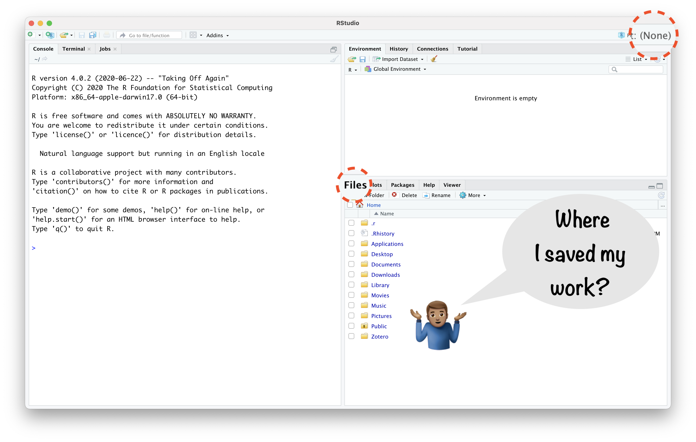
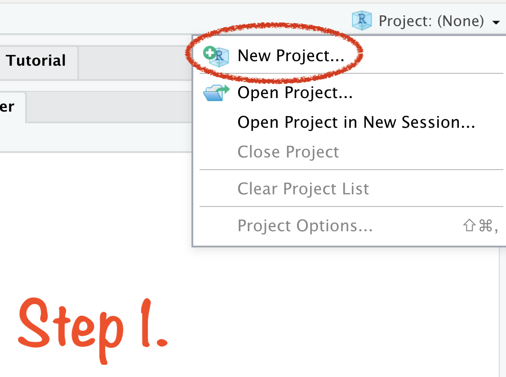
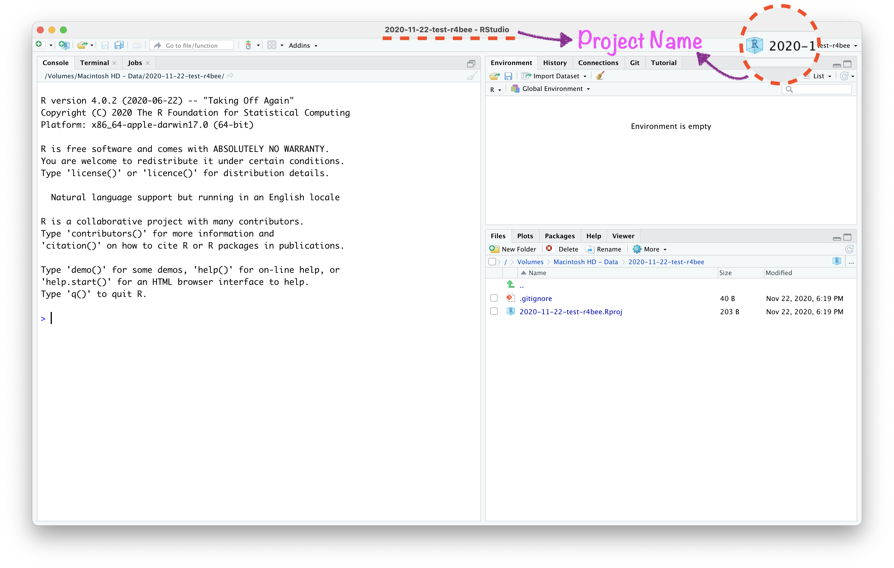
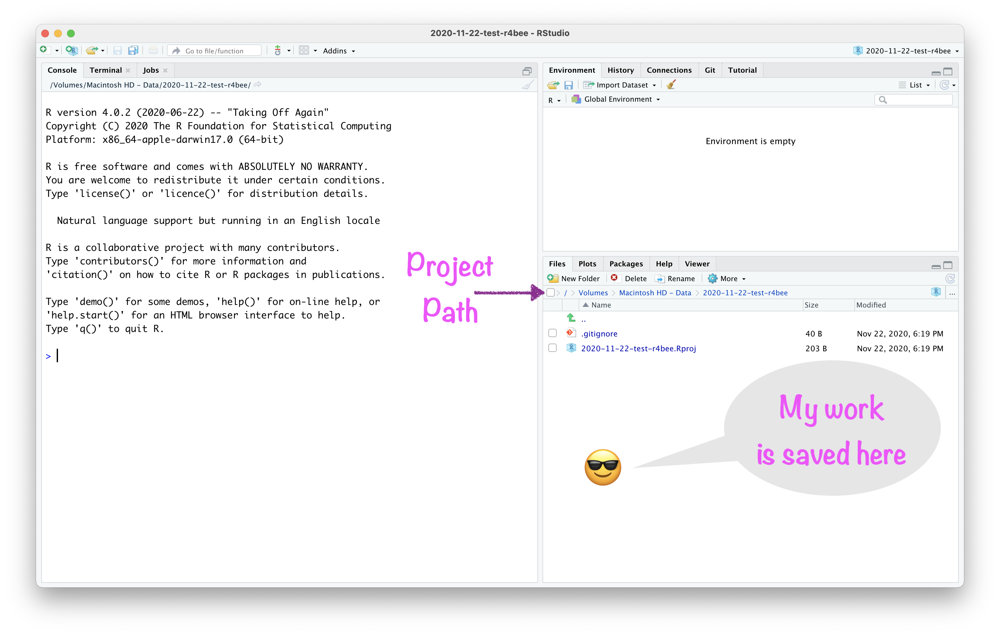
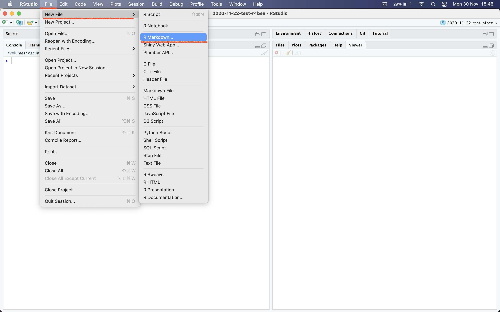
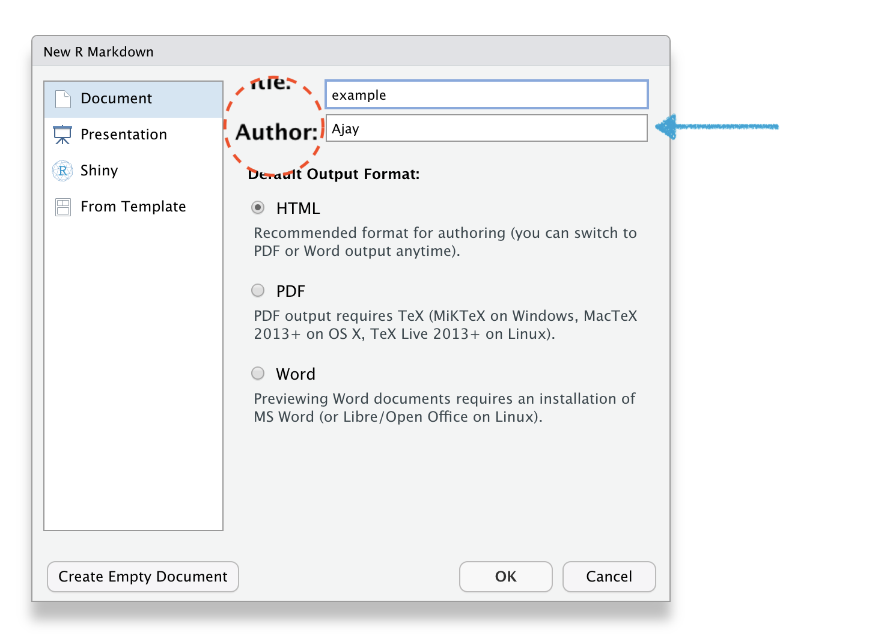
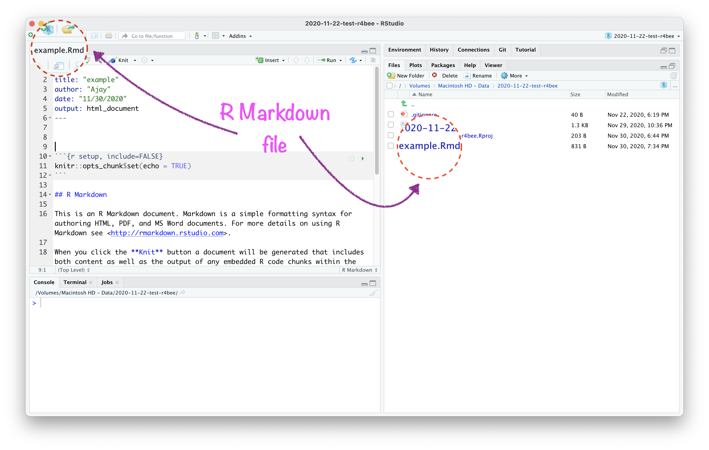
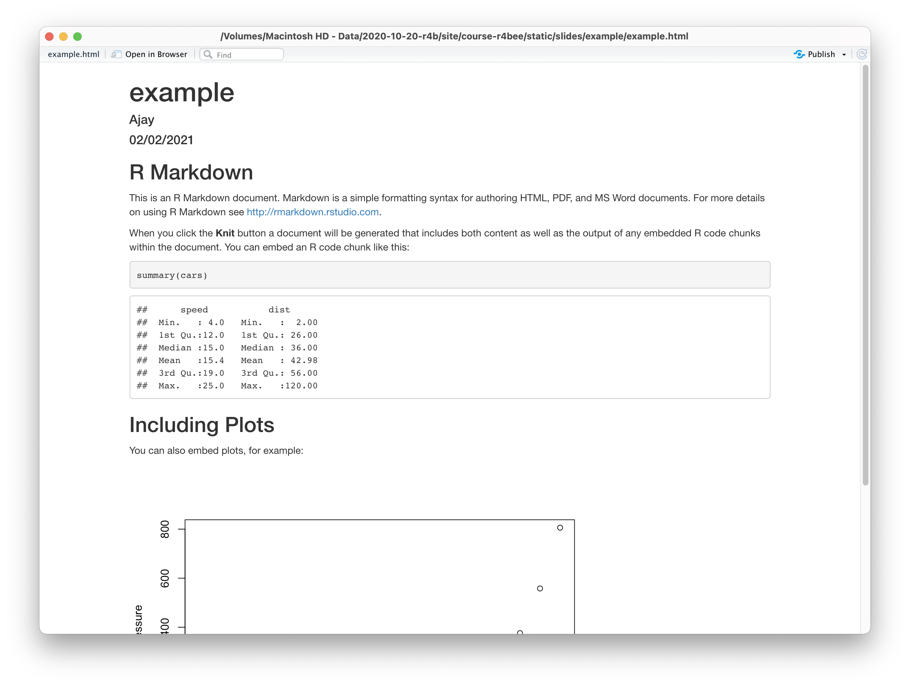

```{r setup, include=FALSE}
options(htmltools.dir.version = FALSE)
knitr::opts_chunk$set(collapse = TRUE,
                      fig.retina = 3,
                      echo = FALSE,
                      fig.align='center')
library(countdown)
library(ymlthis)
library(tidyverse)
library(ggthemes)
library(icons)
library(xaringanExtra)
library(emoji)
library(palmerpenguins)
xaringanExtra::use_tachyons()
xaringanExtra::use_tile_view()
xaringanExtra::use_webcam()
xaringanExtra::use_fit_screen()
xaringanExtra::use_extra_styles(hover_code_line = TRUE, mute_unhighlighted_code = TRUE)
xaringanExtra::use_share_again()
xaringanExtra::use_panelset()

```

```{r meta, echo=FALSE}
library(metathis)
meta() %>%
  meta_general(
    description = "Ajay Koli - Vishwakarma University",
    generator = "xaringan and remark.js"
  ) %>% 
  meta_name("github-repo" = "koliajaykr/plagiarism-zotero") %>% 
  meta_social(
    title = "Research Methodlogy",
    url = "https://starm.netlify.app/",
    image = "https://starm.netlify.app/images/social-card.png",
    og_type = "talk",
    og_author = "Ajay Koli",
    twitter_card_type = "summary_large_image",
    twitter_creator = "@ajay_kolii"
  ) %>%
  include_meta()
```

class: hide-logo, hide-count, inverse

background-image: url("images/flyer.png")
background-size: contain

---

# Modules:

1. .b.green[Basics of R & RStudio]

1. .b.orange[Dynamic Documents using R Markdown]

1. .b.orange[Data Visualisation using ggplot2]

1. .b.orange[Data Wrangling using dplyr]

1. .b.orange[Slidecrafting using xaringan]

---

class: title-slide, hide-count, hide-logo

background-image: url("https://images.unsplash.com/photo-1617063033111-74cf600531d8?ixlib=rb-1.2.1&ixid=MnwxMjA3fDB8MHxwaG90by1wYWdlfHx8fGVufDB8fHx8&auto=format&fit=crop&w=1776&q=80")

background-size: cover

# .white.big-text[`r rmarkdown::metadata$title`]
## .white[Session - 2]

<br>
<br>
<br>
<br>
<br>

---
class: middle, hide-logo

.pull-left[
```{r , echo=FALSE, out.width="70%", fig.align='left'}

knitr::include_graphics("images/ajaykoli.png") 
# `r format(Sys.Date(), "%d %B %Y") 
# <i class="fab fa-r-project"></i>
```

Dr Ajay Kumar Koli<br>Assistant Professor<br>Department of Travel & Tourism<br>Vishwakarma University - Pune<br>`r icon::fa("twitter")` [@ajay_kolii](https://twitter.com/ajay_kolii)<br>`r icon::fa("envelope")` [koliajaykumar@gmail.com](koliajaykumar@gmail.com)

]

.pull-right[
<br>
<br>
<br>
<br>
# .big-text[Hello! `r emo::ji("blush")`]

]

---

class: center

# Open RStudio

```{r echo=FALSE, out.width="90%"}
knitr::include_graphics("images/rstd-proj.png")
```

---

class: center

# Open RStudio

```{r echo=FALSE, out.width="90%"}
knitr::include_graphics("images/rstd-proj-none.png")
```


---

class: center

# Open RStudio

```{r echo=FALSE, out.width="90%"}

```

---

class: hide-logo, hide-count, left, middle

background-image: url("images/project-logo.png")
background-size: contain
background-position: 110%

# .big-text[RStudio<br>Project]


---

background-image: url("images/r-projects.jpg")
background-size: 62%
background-position: 100% 80%

# About RStudio Projects

- "to divide your work into multiple contexts, each with their own:         

--

  - working directory, 
  
--
  
  - workspace, 
  
--
  
  - history, and 
  
--
  
  - source documents."

.footnote[

[Source](https://support.rstudio.com/hc/en-us/articles/200526207-Using-Projects) & Artwork [Source](https://www.allisonhorst.com/) 

]

---

class: center, middle, hide-logo, hide-count

background-color: silver

# `r emo::ji("fire")` Create RStudio Project in 4 Steps `r emo::ji("fire")`

---
class: center, middle

# Create RStudio Project in 4 Steps

```{r echo=FALSE, out.width="65%"}

```

---
class: center, middle

# Create RStudio Project in 4 Steps

```{r echo=FALSE, out.width="65%"}
knitr::include_graphics("images/rstd-proj-2.png")
```

---
class: center, middle

# Create RStudio Project in 4 Steps

```{r echo=FALSE, out.width="65%"}
knitr::include_graphics("images/rstd-proj-3.png")
```

---
class: center, middle

# Create RStudio Project in 4 Steps

```{r echo=FALSE, out.width="65%"}
knitr::include_graphics("images/rstd-proj-4.png")
```

---

class: center

# Open RStudio Project

```{r echo=FALSE, out.width="90%"}

```

---

class: center

# Open RStudio Project

```{r echo=FALSE, out.width="90%"}
knitr::include_graphics("images/rstd-project-path.png")
```

---

class: center

# Open RStudio Project

```{r echo=FALSE, out.width="90%"}

```

---

class: hide-count, middle, left, hide-logo

background-image: url("images/logo-rmd.png")
background-size: contain
background-position: right

# .big-text[R<br>Package]

---

# About R Markdown:

- "The rmarkdown package helps you create **dynamic analysis documents** that combine code, rendered output (such as figures), and prose."

--

- "You bring your data, code, and ideas, and R Markdown renders your content into a polished document that can be used to:

--

  - Do data science interactively within the RStudio IDE,

--

  - Reproduce your analyses,

--

  - Collaborate and share code with others, and

--

  - Communicate your results with others."

.footnote[
[Source](https://github.com/rstudio/rmarkdown)
]

---

class: middle, center

# R Markdown

<iframe src="https://player.vimeo.com/video/178485416?color=428bca" width="840" height="500" frameborder="0" allow="autoplay; fullscreen" allowfullscreen></iframe>
<p><a href="https://vimeo.com/178485416">What is R Markdown?</a> from <a href="https://vimeo.com/rstudioinc">RStudio, Inc.</a> on <a href="https://vimeo.com">Vimeo</a>.</p>

---
class: center, middle, hide-logo, hide-count

background-color: silver

# How to create R Markdown file (`.Rmd`)?

---

class: center

# File $\rightarrow$ New File $\rightarrow$ R Markdown

```{r echo=FALSE, out.width="90%"}

```

---

class: center

# R Markdown

```{r echo=FALSE, out.width="65%", fig.align='center'}
knitr::include_graphics("images/script-options.png")
```

---

class: center

# R Markdown

```{r echo=FALSE, out.width="65%"}
knitr::include_graphics("images/script-options1.png")
```

---

class: center

# R Markdown

```{r echo=FALSE, out.width="65%"}

```

---

class: center

# R Markdown

```{r echo=FALSE, out.width="65%"}
knitr::include_graphics("images/script-options3.png")
```

---

class: center

# Save your .Rmd file

```{r echo=FALSE, out.width="65%"}
knitr::include_graphics("images/script-save.png")
```

---

class: center

# Name your .Rmd file

```{r echo=FALSE, out.width="85%"}
knitr::include_graphics("images/script-title.png")
```

---

class: center

# Name your .Rmd file

```{r echo=FALSE, out.width="85%"}
knitr::include_graphics("images/script-title1.png")
```

---

class: center

# Save your .Rmd file

```{r echo=FALSE, out.width="85%"}
knitr::include_graphics("images/script-title2.png")
```


---

class: center

# Saved .Rmd file $\rightarrow$ in RStudio Project

```{r echo=FALSE, out.width="95%"}

```

---

exclude: true
class: center

background-image: url("images/script-to-console1.png")
background-size: 70%
background-position: center bottom

# Script file for writing the codes 

---

exclude: true
class: center

background-image: url("images/script-to-console2.png")
background-size: 70%
background-position: center bottom

# Console to process the codes 

---

exclude: true
class: center

background-image: url("images/script-to-console3.png")
background-size: 70%
background-position: center bottom

# R Script $\rightarrow$ Console $\rightarrow$ Output

---

exclude: true
class: center

background-image: url("images/script-to-console4.png")
background-size: 70%
background-position: center bottom

# R Script $\rightarrow$ Console $\rightarrow$ Output

---
class: center, middle

.pull-left[
```{r out.width="100%", echo=FALSE}
knitr::include_graphics("images/rmd-input.png")
```
]

.pull-right[
```{r out.width="100%", echo=FALSE}

```
]

---

background-image: url("images/knit-html.png")
background-size: contain
background-position: center middle

---

# R Markdown has 3 important parts:

##- .purple[YAML]

##- .orange[Code chunk]

##- .blue[Text]

---

background-image: url("images/temp-yaml.png")
background-size: cover
background-position: left

---

background-image: url("images/temp-chunk.png")
background-size: cover
background-position: left

---

background-image: url("images/temp-text.png")
background-size: cover
background-position: left

---

# `r emo::ji("knit")` Knit a R Markdown File

- YAML options

- Headings, subheadings, text & LaTex (le-tech) equations

- Code Chunk

  - Include images

  - Include tables
  
  - Include plot

- Themes

- Multiple Output Formats
  
- [eBook](https://bookdown.org/yihui/rmarkdown-cookbook/)   

---

class: center middle hide-count

# `r emo::ji("man_raising_hand")` `r emo::ji("woman_raising_hand")`<br>.big-text[Q&A]

---

class: center, middle, inverse

# .orange[Next Session]
# Data Visualisation<br>Using ggplot2