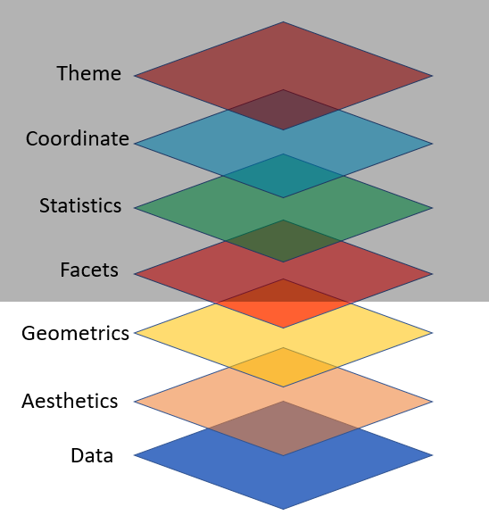

```{r setup, include=FALSE}
options(htmltools.dir.version = FALSE)
knitr::opts_chunk$set(collapse = TRUE,
                      fig.retina = 3,
                      echo = FALSE,
                      fig.align='center')
library(countdown)
library(ymlthis)
library(tidyverse)
library(scales)
library(ggthemes)
library(icons)
library(xaringanExtra)
library(emoji)
library(palmerpenguins)
xaringanExtra::use_tachyons()
xaringanExtra::use_tile_view()
xaringanExtra::use_webcam()
xaringanExtra::use_fit_screen()
xaringanExtra::use_extra_styles(hover_code_line = TRUE, mute_unhighlighted_code = TRUE)
xaringanExtra::use_share_again()
xaringanExtra::use_panelset()

```

```{r meta, echo=FALSE}
library(metathis)
meta() %>%
  meta_general(
    description = "Ajay Koli - Vishwakarma University",
    generator = "xaringan and remark.js"
  ) %>% 
  meta_name("github-repo" = "koliajaykr/plagiarism-zotero") %>% 
  meta_social(
    title = "Research Methodlogy",
    url = "https://starm.netlify.app/",
    image = "https://starm.netlify.app/images/social-card.png",
    og_type = "talk",
    og_author = "Ajay Koli",
    twitter_card_type = "summary_large_image",
    twitter_creator = "@ajay_kolii"
  ) %>%
  include_meta()
```

class: hide-logo, hide-count, inverse

background-image: url("images/flyer.png")
background-size: contain

---

# Modules:

1. .green[Basics of R & RStudio]

1. .green[Dynamic Documents using R Markdown]

1. .b.orange[Data Visualisation using ggplot2]

1. .orange[Data Wrangling using dplyr]

1. .orange[Slidecrafting using xaringan]


---

class: title-slide, center, middle, hide-count, hide-logo

background-image: url("https://images.unsplash.com/photo-1617164924207-40e6ee7c3ffe?ixlib=rb-1.2.1&ixid=MnwxMjA3fDB8MHxwaG90by1wYWdlfHx8fGVufDB8fHx8&auto=format&fit=crop&w=1740&q=80")
background-size: cover

# .white.big-text[Data Visualisation]
## .white[Session - 3]

---

class: center

# Course Progress

```{r echo=FALSE, out.width="100%"}
knitr::include_graphics("images/data-science-communicate.png")
```

---

class: left, middle, hide-count, hide-logo

background-image: url("images/ggplot-logo.png")
background-size: contain
background-position: 100% 50%

# .big-text[R<br>Package]

---

# Packages required: 

```{r pkgs, eval=FALSE, echo=TRUE}
library(palmerpenguins) # to access penguin data
library(tidyverse) # to use ggplot2 pkg
```

- Packages recommended:

```{r more-pkgs, eval=FALSE, echo=TRUE}
install.packages(c(
  "directlabels", "dplyr", "gameofthrones", "ggforce", "gghighlight", 
  "ggnewscale", "ggplot2", "ggraph", "ggrepel", "ggtext", "ggthemes", 
  "hexbin", "mapproj", "maps", "munsell", "ozmaps", "paletteer", 
  "patchwork", "rmapshaper", "scico", "seriation", "sf", "stars", 
  "tidygraph", "tidyr", "wesanderson" 
))
```

---

# ggplot2 by [Hadley Wickham](http://hadley.nz/)
<br>
- "is a system for declaratively creating graphics, based on [The Grammar of Graphics](https://www.springer.com/gp/book/9780387245447)" (book by Late Leland Wilkinson)

.pull-left[
```{r wilkinson, echo=FALSE, out.width="40%", fig.cap="Late Leland Wilkinson"}
knitr::include_graphics("https://upload.wikimedia.org/wikipedia/en/b/b5/Leland_Wilkinson.png")
```
]

.pull-right[
```{r hadley, echo=FALSE, out.width="58%", fig.cap="Hadley Wickham"}
knitr::include_graphics("images/hadley.jpg")
```
]

.footnote[
[Source](https://ggplot2.tidyverse.org/)
]

---
class: hide-count, hide-logo

background-image: url("images/layer7.png")
background-size: contain
background-position: 50% 50%

.footnote[
[Source](https://www.ericchowkokyew.com/data-visualization-with-ggplot2-in-r/)
]

---

.panelset[

.panel[.panel-name[Task]

```{r layer11, echo=FALSE, out.width="45%"}
knitr::include_graphics("images/layer1.png")
```

]

.panel[.panel-name[Codes]

```{r imp-data1, eval=FALSE, echo=TRUE , echo=TRUE}
ggplot(data = penguins) #<<
```

]

.panel[.panel-name[Output]

```{r ref.label="imp-data1", echo=FALSE}
```

]
]

---

.panelset[

.panel[.panel-name[Task]

```{r layer2, echo=FALSE, out.width="45%"}
knitr::include_graphics("images/layer2.png")
```

]

.panel[.panel-name[Codes]

```{r aes, eval=FALSE, echo=TRUE}
ggplot(data = penguins,
       mapping = aes(x = species)) #<<
```

]

.panel[.panel-name[Output]

```{r ref.label="aes", echo=FALSE}
```

]
]

---

.panelset[

.panel[.panel-name[Task]

```{r layer3, echo=FALSE, out.width="45%"}

```

]

.panel[.panel-name[Codes]

```{r geom-bar, eval=FALSE, echo=TRUE}
ggplot(data = penguins,
       mapping = aes(x = species)) +
  geom_bar() #<<
```

]

.panel[.panel-name[Output]

```{r ref.label="geom-bar", echo=FALSE}
```

]
]

---

class: center, middle

# How to export plot to your computer?

---

.panelset[

.panel[.panel-name[Codes]

```{r export-plot, eval=FALSE, echo=TRUE}
ggplot(data = penguins,
       mapping = aes(x = species)) +
  geom_bar() 
  ggsave("peng-species.pdf")  # also try jpg/jpeg/png #<<
```

]

.panel[.panel-name[Output]

```{r ref.label="export-plot", echo=FALSE}

```

]
]

---
class: center, middle

# How to add color to bars?

---

.panelset[

.panel[.panel-name[Codes]

```{r color, eval=FALSE, echo=TRUE}
ggplot(data = penguins,
       mapping = aes(x = species)) +
  geom_bar(fill = "blue") #<<
```

]

.panel[.panel-name[Output]

```{r ref.label="color", echo=FALSE}

```

]
]

---

.panelset[

.panel[.panel-name[Codes]

```{r colors, eval=FALSE, echo=TRUE}
ggplot(data = penguins,
       mapping = aes(x = species)) +
  geom_bar(fill = c("blue", "red", "green")) #<<

# color names should be equal to the factor levels
# in case of factor species levels are three
# Adele, Chinstrap & Gentoo
```

]

.panel[.panel-name[Output]

```{r ref.label="colors", echo=FALSE}

```

]
]

---

class: center, middle

# How to add text labels on the plot?

---

.panelset[

.panel[.panel-name[Codes]

```{r count-spec, eval=FALSE, echo=TRUE}
penguins %>% 
  count(species) #<<
```

]

.panel[.panel-name[Output]

```{r ref.label="count-spec", echo=FALSE}

```

]
]

---

.panelset[

.panel[.panel-name[Codes]

```{r prop-spec, eval=FALSE, echo=TRUE}
penguins %>% 
  count(species) %>% 
  mutate(prop = n / sum(n))
```

]

.panel[.panel-name[Output]

```{r ref.label="prop-spec", echo=FALSE}

```

]
]

---

.panelset[

.panel[.panel-name[Codes]

```{r prop-plot, eval=FALSE, echo=TRUE}
penguins %>% 
  count(species) %>% 
  mutate(prop = n / sum(n)) %>% 
  ggplot(aes(x = prop, y = species)) +
  geom_col() #<<
```

]

.panel[.panel-name[Output]

```{r ref.label="prop-plot", echo=FALSE}

```

]
]

---

class: center, middle

# How to reorder the factor levels in the plot?

---

.panelset[

.panel[.panel-name[Codes]

```{r fct-order, eval=FALSE, echo=TRUE}
penguins %>% 
  count(species) %>% 
  mutate(prop = n / sum(n)) %>% 
  ggplot(aes(x = prop,
             y = fct_reorder(species, prop) #<<
             )
         ) + 
  geom_col()
```

]

.panel[.panel-name[Output]

```{r ref.label="fct-order", echo=FALSE}

```

]
]

---

class: center, middle

# How to add percent values on the plot?

---

.panelset[

.panel[.panel-name[Codes]

```{r percent-plot, eval=FALSE, message=FALSE, echo=TRUE}
penguins %>% 
  count(species) %>% 
  mutate(prop = n / sum(n)) %>% 
  ggplot(aes(x = prop, y = fct_reorder(species, prop))) + 
  geom_col() +
  scale_x_continuous(labels = label_percent(accuracy = 1)) #<<
```

]

.panel[.panel-name[Output]

```{r ref.label="percent-plot", echo=FALSE}

```

]
]

---

class: center, middle

# How to add plot title, subtitle, comments, and axis labels?

---

.panelset[

.panel[.panel-name[Codes]

```{r labs-plot, eval=FALSE, message=FALSE, echo=TRUE}
penguins %>% 
  count(species) %>% 
  mutate(prop = n / sum(n)) %>% 
  ggplot(aes(x = prop, y = fct_reorder(species, prop))) + 
  geom_col() +
  scale_x_continuous(labels = label_percent(accuracy = 1)) +
  labs( #<<
    x = "Percentage",
    y = "Species",
    title = "Species distribution of penguins",
    subtitle = "Adelie, Gentoo, and Chinstrap Penguins at Palmer Station LTER",
    caption = "Source: allisonhorst.github.io/palmerpenguins") 
```

]

.panel[.panel-name[Output]

```{r ref.label="labs-plot", echo=FALSE}

```

]
]

---

class: center, middle

# How to add color in plot based upon another variable?

---

- `library(RColorBrewer)` use RColorBrewer package.

--

- `scale_fill_brewer()` function for box plot, bar plot, violin plot, dot plot, etc.

--

- `scale_color_brewer()` function for lines and points.


.footnote[
Source: [DATA NOVIA](https://www.datanovia.com/en/blog/the-a-z-of-rcolorbrewer-palette/)
]

---

.panelset[

.panel[.panel-name[Codes]

```{r palet-color, eval=FALSE, message=FALSE, echo=TRUE}
penguins %>% 
  count(species) %>% 
  mutate(prop = n / sum(n)) %>% 
  ggplot(aes(x = prop, y = fct_reorder(species, prop),
             fill = species)) + #<<
  geom_col() +
  scale_x_continuous(labels = label_percent(accuracy = 1)) +
  labs( 
    x = "Percentage",
    y = "Species",
    title = "Species distribution of penguins",
    subtitle = "Adelie, Gentoo, and Chinstrap Penguins at Palmer Station LTER",
    caption = "Source: allisonhorst.github.io/palmerpenguins") 
```

]

.panel[.panel-name[Output]

```{r ref.label="palet-color", echo=FALSE}

```

]
]

---

class: center, middle

# How to create a plot object?

---

.panelset[

.panel[.panel-name[Codes]

```{r plot-obj, eval=FALSE, message=FALSE, echo=TRUE}
species_plot <- penguins %>% 
  count(species) %>% 
  mutate(prop = (n / sum(n))) %>% 
  ggplot(aes(x = prop, y = fct_reorder(species, prop),
             fill = species)) + 
  geom_col() +
  scale_x_continuous(labels = label_percent(accuracy = 1)) +
  labs( 
    x = "Percentage",
    y = "Species",
    title = "Species distribution of penguins",
    subtitle = "Adelie, Gentoo, and Chinstrap Penguins at Palmer Station LTER",
    caption = "Source: allisonhorst.github.io/palmerpenguins") 

species_plot #<<
```

]

.panel[.panel-name[Output]

```{r ref.label="plot-obj", echo=FALSE}

```

]
]


---

.panelset[

.panel[.panel-name[Codes]

```{r palet-plot, eval=FALSE, message=FALSE, echo=TRUE}
species_plot +
  scale_fill_brewer(palette = "Dark2") + #<<
  theme(legend.position = "none") #<<
```

]

.panel[.panel-name[Output]

```{r ref.label="palet-plot", echo=FALSE}

```

]
]

---

class: center, middle

# How to change font size of the text labels?

---

.panelset[

.panel[.panel-name[Codes]

```{r fontsize, eval=FALSE, message=FALSE, echo=TRUE}
species_plot +
  scale_fill_brewer(palette = "Dark2") +
  theme(legend.position = "none") +
  theme(text = element_text(size = 20)) #<<
```

]

.panel[.panel-name[Output]

```{r ref.label="fontsize", echo=FALSE, fig.width=15}

```

]
]

.footnote[
Source: [Statistics Globe](https://statisticsglobe.com/change-font-size-of-ggplot2-plot-in-r-axis-text-main-title-legend)
]

---

class: center, middle

# How to add count labels <br>on the bar plot?

---

.panelset[

.panel[.panel-name[Codes]

```{r count-lab, eval=FALSE, message=FALSE, echo=TRUE}
species_plot +
  scale_fill_brewer(palette = "Dark2") +
  theme(text = element_text(size = 20),
        legend.position = "none") +
  geom_text(aes(label = prop), size = 12, hjust = 0, color = "white") #<<
```

]

.panel[.panel-name[Output]

```{r ref.label="count-lab", echo=FALSE, fig.width=15}

```

]
]

---

class: center, middle

# How to add a different theme to plot?

---

.panelset[

.panel[.panel-name[Task]

```{r layer07, echo=FALSE, out.width="45%"}
knitr::include_graphics("images/layer7.png")
```

]

.panel[.panel-name[Codes]

```{r theme1, eval=FALSE, echo=TRUE}

library(ggthemes) #<<

species_plot +
  scale_fill_brewer(palette = "Dark2") +
  geom_text(aes(label = n), size = 12, hjust = 2, color = "white") +
  theme_excel() + #<<
  theme(text = element_text(size = 20),
        legend.position = "none")

# keep the order theme_bw() then theme()
```

]

.panel[.panel-name[Output]

```{r ref.label="theme1", echo=FALSE}

```

]
]

---

.panelset[

.panel[.panel-name[Codes]

```{r theme2, eval=FALSE, echo=TRUE}
species_plot +
  scale_fill_brewer(palette = "Dark2") +
  geom_text(aes(label = n), size = 12, hjust = 2, color = "white") +
  theme_bw() + #<<
  theme(text = element_text(size = 20),
        legend.position = "none") 

```

]

.panel[.panel-name[Output]

```{r ref.label="theme2", echo=FALSE}

```

]
]

---

.panelset[

.panel[.panel-name[Codes]

```{r theme3, eval=FALSE, echo=TRUE}
species_plot +
  scale_fill_brewer(palette = "Dark2") +
  geom_text(aes(label = n), size = 12, hjust = 2, color = "white") +
  theme_dark() + #<<
  theme(text = element_text(size = 20),
        legend.position = "none") 

# keep the order theme_bw() then theme()
```

]

.panel[.panel-name[Output]

```{r ref.label="theme3", echo=FALSE}

```

]
]

---

.panelset[

.panel[.panel-name[Codes]

```{r theme4, eval=FALSE, echo=TRUE}
species_plot +
  scale_fill_brewer(palette = "Dark2") +
  geom_text(aes(label = n), size = 12, hjust = 2, color = "white") +
  theme_classic() + #<<
  theme(text = element_text(size = 20),
        legend.position = "none") 

# keep the order theme_bw() then theme()
```

]

.panel[.panel-name[Output]

```{r ref.label="theme4", echo=FALSE}

```

]
]

---

.panelset[

.panel[.panel-name[Codes]

```{r theme5, eval=FALSE, echo=TRUE}
species_plot +
  scale_fill_brewer(palette = "Dark2") +
  geom_text(aes(label = n), size = 12, hjust = 2, color = "white") +
  theme_tufte() + #<<
  theme(text = element_text(size = 20),
        legend.position = "none") 

# keep the order theme_bw() then theme()
```

]

.panel[.panel-name[Output]

```{r ref.label="theme5", echo=FALSE}

```

]
]

---

class: center middle hide-count

# `r emo::ji("man_raising_hand")` `r emo::ji("woman_raising_hand")`<br>.big-text[Q&A]

---

class: center, middle, inverse

# .orange[Next Session]
# Dynamic Documents<br>Using R Markdown