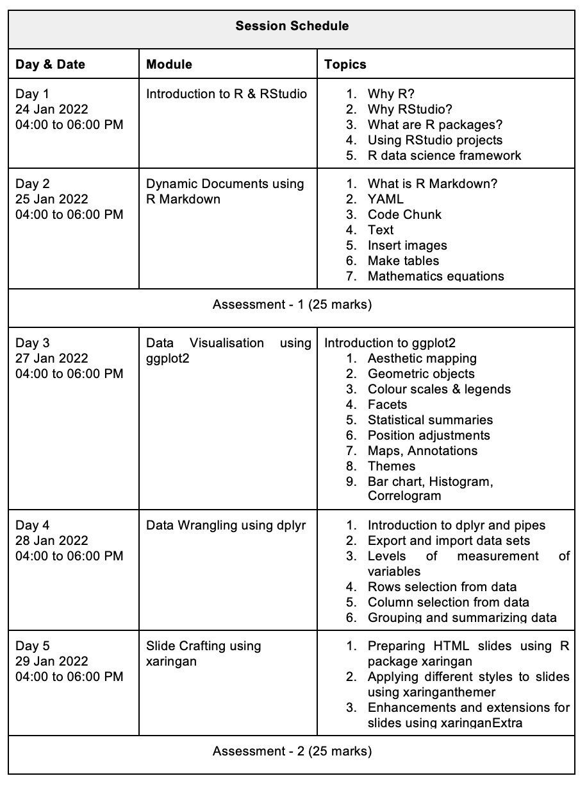

```{r setup, include=FALSE}
knitr::opts_chunk$set(echo = TRUE,
                      fig.retina = 3)

library(emo)
library(icon)
library(fontawesome)
library(tinytex)
library(readr)
```


Dear madam or sir,

$\vspace{5pt}$

Thank you for registering for this online training course. We would like to welcome all participants. Please go through a few guidelines to follow while attending this course:

- You should bring to the sessions a working laptop, good internet and a lot of curiosity.

- Your humble, interactive and peaceful participation is expected. 

- Join each session before five minutes using this Google Meet Link is https://meet.google.com/igu-qsjg-ndi

- This link is created only for you. Kindly do not share with anyone else.

- Your mobile number will be used to create a WhatsApp group to share the screenshot of outputs and errors.

- Each module details are shared on page number 2.

- After every session, you will receive the session slides and video recording.

- There will be two assessments that strictly follow the deadline.

- Your formal feedback will be taken at the end of the course.

Professor Remi Thomas is the coordinator of this course. Kindly contact him for administrative queries. And, your questions related to the course modules should come to me.

We are very excited to meet you all.

All best wishes,

$\vspace{5pt}$

Dr Ajay Kumar Koli | Resource Person

`r icon::fa("envelope")` ajay.koli@vupune.ac.in  
`r icon::fa("globe")` https://ajaykoli.netlify.app  
`r icon::fa("twitter")` https://twitter.com/koliajaykr  
`r icon::fa("linkedin")` https://www.linkedin.com/in/ajay-kumar-koli-893702a4/

$\vspace{5pt}$

Prof. Remi Thomas | Coordinator

`r icon::fa("envelope")` remi.thomas@vupune.ac.in    
`r icon::fa("mobile")` 99708 55213  
`r icon::fa("linkedin")` https://www.linkedin.com/in/remijthomas/

\newpage

```{r echo=FALSE, fig.align='center', out.width="100%"}

```

