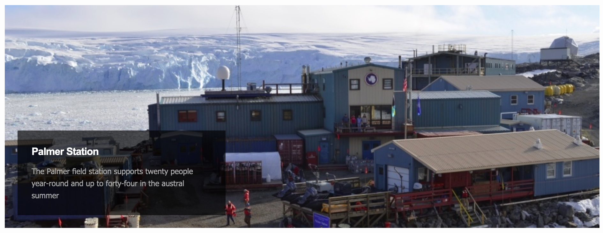

```{r setup, include=FALSE}
options(htmltools.dir.version = FALSE)
knitr::opts_chunk$set(collapse = TRUE,
                      fig.retina = 3,
                      echo = FALSE,
                      fig.align='center')
library(countdown)
library(ymlthis)
library(tidyverse)
library(ggthemes)
library(icons)
library(xaringanExtra)
library(emoji)
library(palmerpenguins)
xaringanExtra::use_tachyons()
xaringanExtra::use_tile_view()
xaringanExtra::use_webcam()
xaringanExtra::use_fit_screen()
xaringanExtra::use_extra_styles(hover_code_line = TRUE, mute_unhighlighted_code = TRUE)
xaringanExtra::use_share_again()
xaringanExtra::use_panelset()

```

```{r meta, echo=FALSE}
library(metathis)
meta() %>%
  meta_general(
    description = "Ajay Koli - Vishwakarma University",
    generator = "xaringan and remark.js"
  ) %>% 
  meta_name("github-repo" = "koliajaykr/plagiarism-zotero") %>% 
  meta_social(
    title = "Research Methodlogy",
    url = "https://starm.netlify.app/",
    image = "https://starm.netlify.app/images/social-card.png",
    og_type = "talk",
    og_author = "Ajay Koli",
    twitter_card_type = "summary_large_image",
    twitter_creator = "@ajay_kolii"
  ) %>%
  include_meta()
```

class: hide-logo, hide-count, inverse

background-image: url("images/flyer.png")
background-size: contain

---

# Modules:

1. .b.green[Basics of R & RStudio]

1. .b.green[Dynamic Documents using R Markdown]

1. .b.orange[Data Visualisation using ggplot2]

1. .b.orange[Data Wrangling using dplyr]

1. .b.orange[Slidecrafting using xaringan]

# SESSION 4 WRANGLING

---
name: session4

class: title-slide, right, middle, hide-count, hide-logo

background-image: url("https://images.unsplash.com/photo-1591903934817-c02acbfd4665?ixlib=rb-1.2.1&ixid=MnwxMjA3fDB8MHxwaG90by1wYWdlfHx8fGVufDB8fHx8&auto=format&fit=crop&w=1932&q=80")
background-size: cover

<br>
<br>
<br>
<br>

# .black.big-text[Data<br>Wrangling]
## .black[Session - 4]

---

class: center

# Course Progress

```{r echo=FALSE, out.width="100%"}
knitr::include_graphics("images/data-science-wrangle.png")
```


---

# `r emo::ji("dart")` Objectives:

1.   To import & export data

--

1.   To perform data manipulation for rows

--

1.   To perform data manipulation for columns

--

1.   To calculate summary statistics for the variables

---

# What is Data wrangling?

--

- "data exploration and data manipulation" [(Jesse Mostipak)](https://www.kaggle.com/jessemostipak/dive-into-dplyr-tutorial-1)

--

- "tidying and transforming" [(Hadley & Garrett)](https://r4ds.had.co.nz/index.html)

---

background-image: url(images/02-wrangling/tidy-1.png)
background-size: 75%
background-position: 50% 55%

# "Tidying" data means:

- "each column is a variable, and each row is an observation" [(Hadley & Garrett)](https://r4ds.had.co.nz/index.html)

---

# "Transforming" data means:

- "narrowing in on observations of interest ... 

--

- creating **new variables** that are functions of existing variables ... and

--

- calculating a set of **summary statistics**." [(Hadley & Garrett)](https://r4ds.had.co.nz/index.html)

---

class: inverse, center, middle, hide-count

# .big-text[Data]

---

# Palmer penguins data

[Palmer Staion, Antarctica LTER](https://pal.lternet.edu/)

```{r echo=FALSE, out.width="100%"}

```


---

```{r echo=FALSE, message=FALSE}
penguins <- read_csv("data/penguins.csv")
```

# Included variables are:

- `r names(penguins)`

```{r echo=FALSE, out.width="70%", fig.align='center'}
knitr::include_graphics("images/lter_penguins.png")
```

.footnote[
Artwork by [@allison_horst](https://www.allisonhorst.com/)
]

---

# Included variables are:

- `r names(penguins)`

```{r echo=FALSE, out.width="68%", fig.align='center'}
knitr::include_graphics("images/culmen_depth.png")
```

.footnote[
Artwork by [@allison_horst](https://www.allisonhorst.com/)
]

---

class: left, middle, hide-count, hide-logo

background-image: url(images/readr.svg)
background-size: contain
background-position: right

# .big-text[R Package]

---

# `readr` pkg

- "to provide a fast and friendly way to **read rectangular** data (like csv, tsv, and fwf)".

--

- function is `read_csv()`

.footnote[
Source: [tidyverse](https://readr.tidyverse.org/)
]

---

.panelset[

.panel[.panel-name[Codes]

```{r imp-data, eval=FALSE}
# import data
library(readr)

penguins <- read_csv("data/penguins.csv") #<<

penguins

```

]

.panel[.panel-name[Output]

```{r ref.label="imp-data", echo=FALSE, message=FALSE}

```

]
]

---

.panelset[

.panel[.panel-name[Codes]

```{r summry-data, eval=FALSE}
summary(penguins) #<<

```

]

.panel[.panel-name[Output]

```{r ref.label="summry-data", echo=FALSE, message=FALSE}

```

]
]

---

# Variable types in R:

--

- `int` stands for integers, like 4, 55, 300.

--

- `dbl` stands for doubles, or real numbers like 3, 7.45, 1.565, 12.

--

- `chr` stands for character vectors, or strings like names.

--

- `dttm` stands for date-times (a date + a time).

--

- `lgl` stands for logical, vectors that contain only TRUE or FALSE.

--

- `fct` stands for factors, which R uses to represent **categorical variables** with fixed possible values like occupation: student, professional, government, business.

--

- `date` stands for dates.

---

# Change variable types in penguin data:

1. `species` : a **factor** denoting penguin species (Adélie, Chinstrap and Gentoo)

--

1. `island` : a **factor** denoting island in Palmer Archipelago, Antarctica (Biscoe, Dream or Torgersen)

--

1. `bill_length_mm` : a **number** denoting bill length (millimeters)

--

1. `bill_depth_mm` : a **number** denoting bill depth (millimeters)

--

1. `flipper_length_mm` :  an **integer** denoting flipper length (millimeters)

--

1. `body_mass_g` : an **integer** denoting body mass (grams)

--

1. `sex` : a **factor** denoting penguin sex (female, male)

--

1. `year` : an **integer** denoting the study year (2007, 2008, or 2009)

---

.panelset[

.panel[.panel-name[Codes]

```{r col-types, eval=FALSE, echo=TRUE}
penguins <- read_csv("data/penguins.csv")

summary(penguins)
```
]

.panel[.panel-name[Output]

```{r ref.label="col-types", echo=FALSE, message=FALSE}

```

]
]

---

class: hide-count, middle, hide-logo
background-image: url(images/dplyr.svg)
background-size: contain
background-position: right

# .big-text[R<br>Package]

---

# `dplyr` pkg

- "dplyr is a grammar of data manipulation"

--

- "providing a consistent set of verbs that help you solve the most common data manipulation challenges:"

--

  - `filter()` picks cases based on their values.

--

  - `select()` picks variables based on their names.

--

  - `mutate()` adds new variables that are functions of existing variables

--
    
  - `arrange()` changes the ordering of the rows.

--

  - `summarise()` reduces multiple values down to a single summary.

.footnote[
Source: [tidyverse](https://dplyr.tidyverse.org/)
]

---

# To get a glimpse `r emo::ji("eyes")` of your data

.panelset[

.panel[.panel-name[Codes]

```{r glmp-data, eval=FALSE}
library(dplyr)

glimpse(penguins) #<<
```
]

.panel[.panel-name[Output]

```{r ref.label="glmp-data", echo=FALSE, message=FALSE}

```

]
]

---
class: center, middle, inverse, hide-count

# `filter()` function

---

# `filter()` function: Picks cases based on their values.

```{r filter-img, echo=FALSE, fig.align='center', out.width="65%"}
knitr::include_graphics("images/01-filter.png")
```

---

class: center, middle 

# How to have a data of only Gentoo penguins?

---

.panelset[

.panel[.panel-name[Codes]

```{r filter-fun, eval=FALSE}
# three species are Chinstrap, Gentoo, Adelie
penguins %>% 
  filter(species == "Gentoo") #<<
```
]

.panel[.panel-name[Output]

```{r ref.label="filter-fun", echo=FALSE, message=FALSE}

```

]
]

---

class: center, middle

# How to export data file to your computer?

---

.panelset[

.panel[.panel-name[Codes]

```{r filter-fun1, eval=FALSE}
# three species are Chinstrap, Gentoo, Adelie
penguins %>% 
  filter(species == "Gentoo") %>% 
  write_csv("data/gentoo-penguins.csv") #<<

```
]

.panel[.panel-name[Output]

```{r ref.label="filter-fun1", echo=FALSE, message=FALSE}

```

]
]

---

# But wait `r emo::ji("policeman")` what the hell is `%>% `

--

- this is called **pipe** ( `%>%` = control + shift + m)

--

- "a powerful tool for clearly expressing a sequence of **multiple operations**"

--

- interpret/read it as **then**.

```{r echo=T, eval=FALSE}
penguins %>% 
  filter(species == "Gentoo")
```

---

# Comparison: Relational Operators

`x < y`

--

`x > y`

--

`x <= y`

--

`x >= y`

--

`x == y` (equal)

--

`x != y` (not equal)

---
class: center, middle 

# How to have a data of penguins with bill length more than 43 mm?

---

.panelset[

.panel[.panel-name[Codes]

```{r filter-fun2, eval=FALSE}
penguins %>% 
  filter(bill_length_mm > 43)
```
]

.panel[.panel-name[Output]

```{r ref.label="filter-fun2", echo=FALSE, message=FALSE}

```

]
]

---
class: center, middle 

# How to have a data of Gentoo penguins with bill length more than 50 mm?

---
.panelset[

.panel[.panel-name[Codes]

```{r filter-fun3, eval=FALSE, echo=TRUE}
penguins %>% 
  filter(species == "Gentoo",
         bill_length_mm > 50)
```
]

.panel[.panel-name[Output]

```{r ref.label="filter-fun3", echo=FALSE, message=FALSE}

```

]
]

---
class: center, middle 

# How to have data of non-Gentoo penguins with bill length more than 45 mm and weight more than 4 kg?

---

.panelset[

.panel[.panel-name[Codes]

```{r filter-fun4, eval=FALSE, echo=TRUE}
penguins %>% 
  filter(species != "Gentoo",
         bill_length_mm > 45,
         body_mass_g > 4000)
```
]

.panel[.panel-name[Output]

```{r ref.label="filter-fun4", echo=FALSE, message=FALSE}

```

]
]

---
class: center, middle

# How to have only top or bottom rows from data?

---

.panelset[

.panel[.panel-name[Codes]

```{r filter-fun41, eval=FALSE, echo=TRUE}
penguins %>% 
  filter(species != "Gentoo",
         bill_length_mm > 45,
         body_mass_g > 4000) %>% 
  head(3) #<<
```
]

.panel[.panel-name[Output]

```{r ref.label="filter-fun41", echo=FALSE, message=FALSE}

```

]
]

---

.panelset[

.panel[.panel-name[Codes]

```{r filter-fun42, eval=FALSE, echo=TRUE}
penguins %>% 
  filter(species != "Gentoo",
         bill_length_mm > 45,
         body_mass_g > 4000) %>% 
  tail() #<<
```
]

.panel[.panel-name[Output]

```{r ref.label="filter-fun42", echo=FALSE, message=FALSE}

```

]
]

---
class: center, middle, inverse, hide-count

# `select()` function

---

# `select()` function: Chooses rows based on column values.

```{r select-img, echo=FALSE, fig.align='center', out.width="60%"}
knitr::include_graphics("images/03-select.png")
```

---
class: center, middle

# How to have only `species` variable in data?

---

.panelset[

.panel[.panel-name[Codes]

```{r col-fun1, eval=FALSE}
penguins %>% 
  select(species)
```
]

.panel[.panel-name[Output]

```{r ref.label="col-fun1", echo=FALSE, message=FALSE}

```

]
]

---
class: center, middle

# How to have a specific range of variables in data?

---

.panelset[

.panel[.panel-name[Codes]

```{r col-fun2, eval=FALSE}
penguins %>% 
  select(species : bill_depth_mm)
```
]

.panel[.panel-name[Output]

```{r ref.label="col-fun2", echo=FALSE, message=FALSE}

```

]
]

---
class: center, middle

# How to have variables based upon their location in data?

---

.panelset[

.panel[.panel-name[Codes]

```{r col-fun3, eval=FALSE, echo=TRUE}
penguins %>% 
  select(4:8)
```
]

.panel[.panel-name[Output]

```{r ref.label="col-fun3", echo=FALSE, message=FALSE}

```

]
]

---
class: center, middle

# How to have specific variables in data?

---

.panelset[

.panel[.panel-name[Codes]

```{r col-fun4, eval=FALSE, echo=TRUE}
penguins %>% 
  select(species, body_mass_g, year)
```
]

.panel[.panel-name[Output]

```{r ref.label="col-fun4", echo=FALSE, message=FALSE}

```

]
]

---

.panelset[

.panel[.panel-name[Codes]

```{r col-fun5, eval=FALSE, echo=TRUE}
penguins %>% 
  select(-c(species, body_mass_g, year))
```
]

.panel[.panel-name[Output]

```{r ref.label="col-fun5", echo=FALSE, message=FALSE}

```

]
]

---
class: center, middle, inverse

# `mutate()` function

---

# `mutate()` function: Adds new variables that are functions of existing variables

```{r mutate-img, echo=FALSE, fig.align='center', out.width="75%"}
knitr::include_graphics("images/04-mutate.png")
```

---

class: center, middle

# How to convert penguin body mass from grams to kilograms?

---

.panelset[

.panel[.panel-name[Codes]

```{r col-fun7, eval=FALSE, echo=TRUE}
penguins %>% 
  mutate(body_mass_g = body_mass_g / 1000) #<<
```
]

.panel[.panel-name[Output]

```{r ref.label="col-fun7", echo=FALSE, message=FALSE}

```

]
]

---

.panelset[

.panel[.panel-name[Codes]

```{r col-fun8, eval=FALSE, echo=TRUE}
penguins %>% 
  mutate(body_mass_g = body_mass_g / 1000, 
         bill = bill_length_mm * bill_depth_mm)
```
]

.panel[.panel-name[Output]

```{r ref.label="col-fun8", echo=FALSE, message=FALSE}

```

]
]

---

.panelset[

.panel[.panel-name[Codes]

```{r col-fun81, eval=FALSE, echo=TRUE}
penguins %>% 
  mutate(body_mass_g = body_mass_g / 1000,
         bill = bill_length_mm * bill_depth_mm) %>% 
  select(body_mass_g,
         bill)
```
]

.panel[.panel-name[Output]

```{r ref.label="col-fun81", echo=FALSE, message=FALSE}

```

]
]

---
class: center, middle, inverse

# `arrange()` function

---

# `arrange()` function: Changes the order of the rows.

```{r arrange-img, echo=FALSE, fig.align='center', out.width="65%"}
knitr::include_graphics("images/02-arrange.png")
```

---

class: center, middle

# How to have data arranged by the ascending order of bill length of penguins?

---

.panelset[

.panel[.panel-name[Codes]

```{r arg-fun, eval=FALSE, echo=TRUE}
penguins %>% 
  arrange(bill_length_mm) #<<
```
]

.panel[.panel-name[Output]

```{r ref.label="arg-fun", echo=FALSE, message=FALSE}

```

]
]

---

.panelset[

.panel[.panel-name[Codes]

```{r arg-fun2, eval=FALSE, echo=TRUE}
penguins %>% 
  arrange(desc(bill_length_mm)) #<<
```
]

.panel[.panel-name[Output]

```{r ref.label="arg-fun2", echo=FALSE, message=FALSE}

```

]
]

---

.panelset[

.panel[.panel-name[Codes]

```{r arg-fun3, eval=FALSE, echo=TRUE}
penguins %>% 
  arrange(species)
```
]

.panel[.panel-name[Output]

```{r ref.label="arg-fun3", echo=FALSE, message=FALSE}

```

]
]

---

class: center, middle, inverse

# `summarise()` function

---

# `summarise()` function: Chooses rows based on column values.

```{r summ-img, echo=FALSE, fig.align='center', out.width="75%"}
knitr::include_graphics("images/05-summarise.png")
```

---

class: center, middle

# How to find mean bill length of all penguins?

---

.panelset[

.panel[.panel-name[Codes]

```{r summ-fun1, eval=FALSE, echo=TRUE}
penguins %>% 
  drop_na() %>% #<<
  summarise(mean = mean(bill_length_mm)) #<<
```
]

.panel[.panel-name[Output]

```{r ref.label="summ-fun1", echo=FALSE, message=FALSE}

```

]
]

---

class: center, middle

# How to find species-wise mean bill length of penguins?

---

.panelset[

.panel[.panel-name[Codes]

```{r summ-fun2, eval=FALSE, echo=TRUE}
penguins %>% 
  drop_na() %>% 
  group_by(species) %>% #<<
  summarise(mean = mean(bill_length_mm))
```
]

.panel[.panel-name[Output]

```{r ref.label="summ-fun2", echo=FALSE, message=FALSE}

```

]
]

---

class: center, middle

# How to find species-wise mean bill length of penguins and total number of penguins in each species?

---

.panelset[

.panel[.panel-name[Codes]

```{r summ-fun21, eval=FALSE, echo=TRUE}
penguins %>% 
  drop_na() %>% 
  group_by(species) %>% 
  summarise(mean = mean(bill_length_mm), n = n()) #<<
```
]

.panel[.panel-name[Output]

```{r ref.label="summ-fun21", echo=FALSE, message=FALSE}

```

]
]

---

# Useful functions

- Center: `mean()`, `median()`

--

- Spread: `sd()`, `IQR()`, `mad()`

--

- Range: `min()`, `max()`, `quantile()`

--

- Position: `first()`, `last()`, `nth()`,

--

- Count: `n()`, `n_distinct()`

--

- Logical: `any()`, `all()`

.footnote[
Source: [tidyverse.org](https://dplyr.tidyverse.org/reference/summarise.html)
]

---

background-image: url(images/02-wrangling/logo-dplyr.png)
background-size: 10%
background-position: 97% 5%

# [`dplyr`](https://www.rdocumentation.org/packages/dplyr/versions/0.7.8) functions based upon:

--

.panelset[

.panel[.panel-name[Rows]

- `filter()` chooses rows based on column values.
    
- `slice()` chooses rows based on location.
    
- `arrange()` changes the order of the rows.
    
]

.panel[.panel-name[Columns]

- `select()` changes whether or not a column is included.
    
- `rename()` changes the name of columns.
    
- `mutate()` changes the values of columns and creates new columns.
    
- `relocate()` changes the order of the columns.
    
.panel[.panel-name[Groups of rows]

- `summarise()` collapses a group into a single row.

]
]
]

